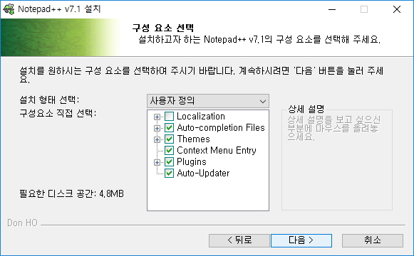

# Unattended Installation

Unattended Installation은 Silent Installation이라고도 한다.
설치 과정에서 사용자 인터렉션이 없거나, 설치를 진행하는 사용자가 필요없는 설치방법을 이야기한다.
다시 말해서, 일단 설치 프로그램을 실행시키면 설치 과정 동안에 사용자로부터 설치에 대한 어떠한 정보도 요구하지 않고 설치 과정을 마무리하는 것을 말하는 것이다.

일반적으로 우리가 흔히 접하는 설치과정은 다음과 같다. (notepad++를 예로들면 ..)

반면에 Unattended Installation은 설치과정에서 사용자에게 어떠한 요구도 하지 않는데, 예전에 Electron으로 개발한 프로그램을 배포하기위해서 사용한 Installer 저작도구인 [Squirrel](https://github.com/Squirrel/Squirrel.Windows)가 이러한 형태의 Installer를 만들어준다.
[Atom](https://atom.io/)의 Installer가 바로 [Squirrel](https://github.com/Squirrel/Squirrel.Windows)를 통해 만들어졌다. [Atom](https://atom.io/)을 설치해보면 설치과정에서 아무것도 물어보지 않고 설치가 끝나며, 설치가 완료되면 [Atom](https://atom.io/)이 실행되는데 이러한 설치가 바로 Unattended Installation이다.

# Reference

https://docs.mongodb.com/manual/tutorial/install-mongodb-on-windows/
http://www.pcmag.com/encyclopedia/term/61761/unattended-install
https://en.wikipedia.org/wiki/Installation_(computer_programs)
