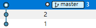
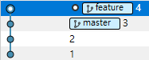
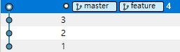

# fast-forward에 대해서

'fast-forward'란 서로 다른 브랜치가 같은 커밋 히스토리를 가지고 있을 때, 서로 다른 변경 이력이 없는 경우 Git은 포인터를 단지 맨 앞으로 이동시키는데 이를 'fast-forward'라 한다.

예를 들어, 다음과 같이 master 브랜치에서 1, 2, 3번의 커밋이 있었다고하자.

이때, 다음과 같이 feature 브랜치를 만들고 4번 커밋을 하였다.

그리고 다시 master 브랜치로 돌아와서 feature 브랜치를 머지하면, 두 브랜치 사이 같은 커밋 히스토리를 가지고 있고, feature 브랜치의 변경에 대해서 master 브랜치는 다른 변경 이력을 만들지 않았기 때문에 다음과 같이 포인터만을 feature 브랜치로 이동 시키는 'fast-forward'를 하게 된다.

이와 같이 fast-forward를 통해 브랜치가 머지되면 변경이력을 추적하기가 용이해진다. 만약 fast-forward를 할 수 없는 경우, 다시 말해서 같은 커밋 히스토리를 갖는 두 브랜치가 서로 다른 변경 이력을 갖는 경우는 rebase를 통해서 커밋 히스토리를 가독성 있게 유지할 수 있다.

## 참조

[Git Branching - Basic Branching and Merging](https://git-scm.com/book/en/v2/Git-Branching-Basic-Branching-and-Merging)
