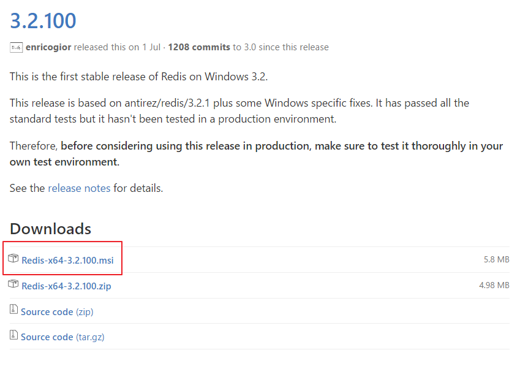

# Windows 10에서 Redis 설치하기

Redis는 공식적으로 윈도우 환경의 Installation을 제공하지 않는다. 다음은 [Redis 공식 홈페이지](http://redis.io/)의 [Download 페이지](http://redis.io/download)에 나와있는 내용이다.

>**Windows**
>
The Redis project does not officially support Windows. However, the Microsoft Open Tech group develops and maintains this Windows port targeting Win64. [Learn more](https://github.com/MSOpenTech/redis)

위 내용 중 [Learn more](https://github.com/MSOpenTech/redis)을 클릭하면 Github의 [MSOpenTech/redis](https://github.com/MSOpenTech/redis)로 연결되는데, [Redis on Windows](https://github.com/MSOpenTech/redis#redis-on-windows)라는 목차의 세번째 항목에 있는 [release page](https://github.com/MSOpenTech/redis/releases)링크를 선택하면 윈도우용 Installer를 다운로드 받을 수 있는 페이지로 연결된다.

[Redis on Windows](https://github.com/MSOpenTech/redis#redis-on-windows)라는 목차의 내용은 다음과 같다.

>**Redis on Windows**
>
* This is a port for Windows based on Redis.
* We officially support the 64-bit version only. Although you can build the 32-bit version from source if desired.
* You can download the latest unsigned binaries and the unsigned MSI installer from the [release page](https://github.com/MSOpenTech/redis/releases).
* For releases prior to 2.8.17.1, the binaries can found in a zip file inside the source archive, under the bin/release folder.
* Signed binaries are available through NuGet and Chocolatey.
* Redis can be installed as a Windows Service.

다음은 [release page](https://github.com/MSOpenTech/redis/releases)링크를 통해 연결 된 웹사이트에서 글을 쓰고 있는 현재(2016.11.01)를 기준으로 최신버전에 대한 다운로드 메뉴를 캡처한 내용이다.  [Redis-x64-3.2.100.msi](https://github.com/MSOpenTech/redis/releases/download/win-3.2.100/Redis-x64-3.2.100.msi)를 다운로드 하자.

설치과정은 간단하므로 설명할 필요는 없을 것 같고, 설치가 다 되면 Redis 서버가 자동으로 윈도우 서비스로 등록된다.

**주의!** 
이 방법으로는 Redis의 최신 버전을 사용할 수 없다. 이를 위해서는 소스를 직접 내려받아서 컴파일해야한다.
