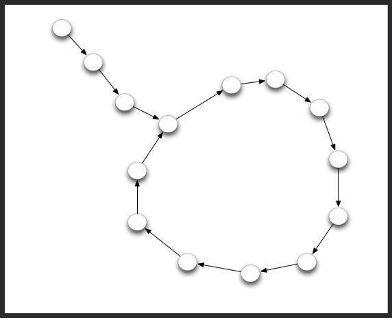

# [Can you get the loop ?](https://www.codewars.com/kata/can-you-get-the-loop/train/python)

You are given a node that is the beginning of a linked list. This list always contains a tail and a loop.

Your objective is to determine the length of the loop.



For example in the following picture the tail's size is 3 and the loop size is 11.

\# Use the `next' attribute to get the following node

node.next

## My Solutions

### Python

```python
def loop_size(node):
    nodes = []
    tail_node = None

    while(not node in nodes):
        nodes.append(node)
        node = node.next

    return len(nodes) - nodes.index(node)
```

### JavaScript


### Go


## Other Solutions

### Python


### JavaScript


### Go