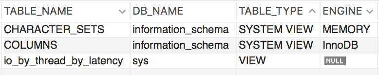

# Table의 소속, 테이블 유형 그리고 엔진 확인하기

유지보수 업무를 하다보면 지금 확인하고 있는 테이블이 어떤 데이터베이스 소속인지, 진짜 Table인지 아니면 View인지 확인하거나 혹은 어떤 엔진을 사용하고 있는지를 확인 할 필요가 있을때가 있다.

이런 경우 INFORMATION_SCHEMA.TABLES의 정보를 이용하면 되는데 다음과 같은 query를 사용하면 편리하다.

WHERE절의 TABLE_NAME IN에 확인하고자 하는 테이블 명들을 넣어주면 된다.

```sql
SELECT
    TABLE_NAME,
    table_schema AS DB_NAME,
    TABLE_TYPE,
    ENGINE
FROM INFORMATION_SCHEMA.TABLES
WHERE TABLE_NAME IN (
    'CHARACTER_SETS',
    'COLUMNS',
    'io_by_thread_by_latency'
)
ORDER BY TABLE_NAME
```

출력 결과는 다음과 같다.



## 참조

* [Mysql - find a table in all database](https://stackoverflow.com/questions/3756742/mysql-find-a-table-in-all-database)
