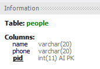

# MySQL Workbench의 Table Infomation의 AI, PK와 같은 약어의 의미

## 개요

MySQL Workbench에서 테이블을 선택하면 Information 메뉴에 해당 테이블에 대한 정보가 출력된다. 

다음 그림을 보면 poeple이란 테이블을 선택했을 때, Information 메뉴에 출력 된 테이블 정보이다. 
pid 컬럼을 보면 AI, PK와 같은 문자가 보이는데 해당 문자의 의미에 대해서 알아봤다.

## 약어의 의미

**PK**: PRIMARY KEY

**NN**: NOT NULL

**UQ**: UNIQUE INDEX

**BIN**: BINARY

**UN**: UNSIGNED

**ZF**: ZEROFILL

**AI**: AUTO_INCREMENT

**G**: Generated Column

## 참조

* [8.1.11.2 The Columns Tab](https://dev.mysql.com/doc/workbench/en/wb-table-editor-columns-tab.html)