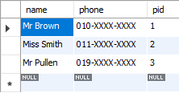
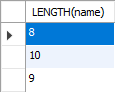

# 문자열 길이 얻는 방법

다음 명령을 통해 문자열 컬럼에 저장 된 데이터의 길이를 구할 수 있다. 

```sql
SELECT LENGTH(<column name>) 
```

다음과 같은 데이터가 있다고 가정하자.



위 데이터에서 name 컬럼의 데이터들의 길이를 구해보자. 

```sql
SELECT LENGTH(name)
```

결과는 다음과 같다. 



* [MySQL LENGTH() function](http://www.w3resource.com/mysql/string-functions/mysql-length-function.php)


