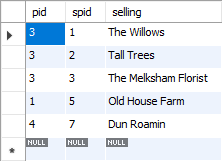

# MySQL의 Join에 대해서

## 개요

SQL을 사용하다 보면 여러 테이블들의 데이터를 조합해야하는 경우 JOIN을 사용한다. SQL에는 다양한 JOIN방법이 존재하는데 MySQL을 통해 이러한 JOIN을 어떻게 하는지 알아보도록 하자.

이에 대해서 공부하기 위해서 다음 두 개의 테이블을 사용한다. 

**Poeple Table**


**Property Table**


## JOIN의 종류

SQL의 JOIN은 다음 그림과 같이 7개의 종류가 존재한다. 


**주의**
* INNER JOIN == JOIN
* LEFT OUTER JOIN == LEFT JOIN
* RIGHT OUTER JOIN == RIGHT JOIN
* MySQL에서는 FULL OUTER JOIN은 제공하지 않는다. 하지만 이를 흉내낼수는 있다. 이에 대해서는 이 글 후반부에서 다룬다. 

## INNER JOIN

INNER JOIN은 JOIN과 같은 명령이며, 두 테이블의 교집합을 구한다. 

PEOPLE 테이블과 PROPERTY 테이블 pid를 기준으로 JOIN하는 쿼리는 다음과 같다. 

```sql
SELECT 
	* 
FROM PEOPLE JOIN PROPERTY
ON PEOPLE.pid = PROPERTY.pid
```

쿼리의 결과는 다음과 같다. 


결과를 보면 PEOPLE 테이블과 PROPERTY 테이블이 가지고 있는 공통 된 pid에 대해서 두 테이블의 데이터가 출력된 것을 알 수 있다.

## LEFT JOIN

LEFT OUTER JOIN은 LEFT JOIN과 같은 명령이며, 두 테이블 중 LEFT JOIN 구문 왼편에 있는 테이블(기준 테이블)의 모든 데이터를 출력하고 오른편에 있는 데이터를 JOIN한다.
따라서, 기준 테이블 보다 기준이 되지 않는 테이블의 데이터가 적은 경우는 데이터가 없으므로 NULL로 출력된다. 

PEOPLE 테이블과 PROPERTY 테이블 pid를 기준으로 LEFT JOIN하는 쿼리는 다음과 같다. 

```sql
SELECT
	*
FROM PEOPLE LEFT JOIN PROPERTY
ON PEOPLE.pid = PROPERTY.pid;
```


결과를 보면 PEOPLE 테이블의 모든 데이터가 출력되었고, PROPERTY 테이블의 경우 pid가 1, 3, 4가 존재하는데 PEOPLE 테이블에 존재하지 않는 4를 제외한 모든 데이터가 출력되었으며
PEOPLE 테이블에 존재하는 pid 2에 대해서는 데이터가 존재하지 않으므로 NULL이 출력된 것을 알 수 있다. 

## RIGHT JOIN

RIGHT OUTER JOIN은 RIGHT JOIN과 같은 명령이며, 두 테이블 중 RIGHT JOIN 구문 오른편에 있는 테이블(기준 테이블)의 모든 데이터를 출력하고 왼편에 있는 데이터를 JOIN한다.
따라서, 기준 테이블 보다 기준이 되지 않는 테이블의 데이터가 적은 경우는 데이터가 없으므로 NULL로 출력된다. 

PEOPLE 테이블과 PROPERTY 테이블 pid를 기준으로 RIGHT JOIN하는 쿼리는 다음과 같다. 

```sql
SELECT
	*
FROM PEOPLE RIGHT JOIN PROPERTY
ON PEOPLE.pid = PROPERTY.pid;
```


결과를 보면 PROPERTY 테이블의 모든 데이터가 출력되었고, PEOPLE 테이블의 경우 pid가 1, 2, 3이 존재하는데 PROPERTY 테이블에 존재하지 않는 2를 제외한 모든 데이터가 출력되었으며
PROPERTY 테이블에 존재하는 pid 4에 대해서는 데이터가 존재하지 않으므로 NULL이 출력된 것을 알 수 있다. 

## 참조

* [Mysql Join 해부(Left, Right, Outer, Inner Join)](http://rapapa.net/?p=311)