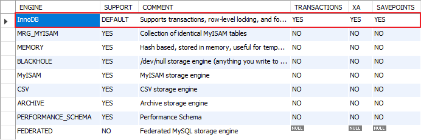

# MySQL에서 제공하는 Storage Engine과 특정 테이블이 사용하고 있는 Storage Engine 조회하기

> MySQL version 5.7

## MySQL에서 제공하는 Storage Engine 조회하기

MySQL은 데이터를 저장하고 관리하기 위한 여러가지 Storage Engine을 제공한다. 그러면, MySQL이 제공하는 Storage Engine이 어떤 것들이 있고, default storage engine이 무엇인지 확인하는 방법은 무엇일까?

다음 두 가지 방법이 있다. 

```sql
SHOW ENGINES;
```

```sql
SELECT * FROM INFORMATION_SCHEMA.ENGINES;
```

위 두 쿼리의 결과는 다음과 같다. 
MySQL version 5.7이 제공하는 Storage Engine의 종류는 다음과 같으며 InnoDB가 default storag engine 인것을 알 수 있다. 



## 특정 테이블이 사용하고 있는 Storage Engine 조회하기

MySQL이 제공하는 Storage Engine이 어떤 것들이 있는지 알았으니, 이번에는 특정 테이블이 사용하고 있는 storage engien이 무엇인지 알아보자.

다음 두 가지 방법이 있다.

### SHOW TABLE STATUS WHERE NAME = 'table name'

SHOW TABLE STATUS은 현재 database의 테이블들의 상세정보를 출력하는 명령인데, 여기에는 해당 테이블이 사용 중인 storage engine도 출력되므로 이를 통해 특정 테이블이 사용 중인 storage engine을 알 수 있다. 

people 테이블이 사용하고 있는 storage engine이 무엇인지 확인해보자. 

```sql
SHOW TABLE STATUS WHERE NAME = 'people'
```

결과는 다음과 같으며 Engine column을 확인하면 된다. people 테이블은 InnoDB를 사용하고 있다. 


### SHOW ENGINE FROM INFORMATION_SCHEMA.TABLES WHERE TABLE_NAME='table name'

앞서 MySQL이 제공하는 storage engine 정보를 얻을 때 INFORMATION_SCHEMA의 ENGINES 테이블을 사용하였는데, TABLES 테이블의 ENGINE column을 통해서 특정 테이블이 사용하고 있는 storage engine을 알 수 있다.

```sql
SHOW ENGINE
FROM INFORMATION_SCHEMA.TABLES
WHERE TABLE_NAME='people'
```

결과는 다음과 같다. 앞선 결과와 동일하게 people 테이블은 InnoDB를 사용하고 있다. 


## 참조

* [14.7.5.16 SHOW ENGINES Syntax](https://dev.mysql.com/doc/refman/5.7/en/show-engines.html)
* [14.7.5.36 SHOW TABLE STATUS Syntax](https://dev.mysql.com/doc/refman/5.7/en/show-table-status.html)
* [How do I find if my a table is MyISAM or Innodb [duplicate]](http://stackoverflow.com/questions/3681790/how-do-i-find-if-my-a-table-is-myisam-or-innodb)