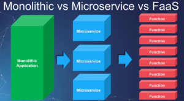
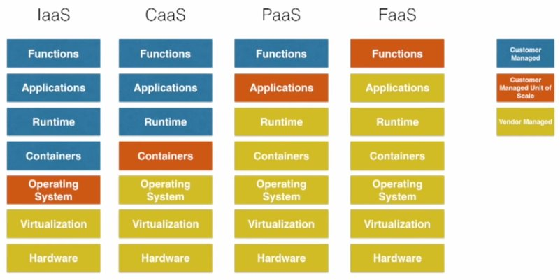

# What is the serverless architecture?

## Serverless Architecture

초기에 Serverless Architecture라 하면 server-side logic과 state를 서비스하고 관리하기 위해 클라우드에 존재하는 third-party service 말했다.  
하지만 요즘에는 stateless compute container에 의해 정의되고 event-driven solution에 의해 모델링 된 service이다.  

복잡하게 이야기했지만, 간단히 이야기하면 우리가 일반적으로 Backend 시스템을 갖추고 어플리케이션을 올리기 위한 서버를 추상화하고 low-level infrastructure에 대한 고민을 개발자가 되도록 하지 않도록 하기 위한 아키텍처로 결국 개발자의 생산성을 높이고 서버의 운영 비용을 줄이기 위한 목적을 가지고 있다.  

이러한 Serverless Architecture를 구현해 놓은 서비스를 FaaS(Function as a Service)라고 한다. 

## FaaS (Function as a Service)

**FaaS**는 비교적 새로운 개념으로 2014년 hook.io에서 처음 발표된 후 현재는 다음과 같은 서비스들이 구현되어있다.  

* AWS Lambda
* Google Cloud Functions
* IBM OpenWhisk
* Microsoft Azure Functions

다음 그림은 전통적인 방식의 서비스 개발 방식(Monolithic)과 이러한 서비스를 역할별로 분리한 MSA(Micro Service Architecture) 그리고 마지막으로 MSA를 다시 쪼개서 Function 단위로 분리한 FaaS를 나타내고 설명하고 있다. 

전통으로 Backend Service를 개발한다고 하면 여러가지 기능들을 하나의 Project에 개발해서 서버에 올려서 서비스를 하였다. 그러다 트래픽이 많아지는 경우 **특히 특정 기능에 대한 트래픽이 많아지는** 상황인데도 하나의 어플리케이션을 새로운 서버에 배포해서 트래팩을 수용하였다.  

이렇게 전통적인 방식으로 서비스를 개발하고 운영하다 보니 어플리케이션의 사이즈가 너무 커져버려 유지보수가 어렵고 확장성이 떨어지게 되었다.  
예를들어, 앞서와 같이 특정 기능에 대한 트래픽이 많아지는 상황인데도 불구하고 하나의 어플리케이션을 통째로 확장해야하는 문제라든가, 특정 기능의 경우 다른 언어로 개발하는 것이 좀 더 유리한데도 불구하고 하나의 어플리케이션으로 모든 기능을 구현하다보니 생기는 제약 또는 하나의 마스터 DB에 과도하게 걸리는 부하 문제 등을 해소하기 위해 어플리케이션를 기능별로 쪼개서 구현 및 운영하기 위해서 MSA가 나오게 되었다. 

하지만 MSA로 기존 Monolithic구조의 어플리케이션을 기능 단위로 쪼갰다 하더라도 Monolithic구조의 어플리케이션이 가지고 있던 문제가 완전히 해결되는 것은 아니다. 
예를들어, MSA로 분리 된 기능 단위의 서비스 중에서도 빈번하게 호출되는 API와 그렇지 않은 API들이 존재할 것이다. 이러한 경우 역시 자주 호출되지 않는 API를 운영하기 위해서 비용이 지속적으로 발생하게 될 것이다.

FaaS는 MSA 개발 된 기능단위의 서비스를 Function 단위로 다시 쪼개고 클라우드 서비스에 해당 Function을 등록해서 서비스하는 방식으로 기본적으로 해당 함수가 호출 된 횟수에 따라 비용이 발생하게 된다. 따라서 기존의 방식에 비해 운영 비용을 많이 절감할 수 있다. 

FaaS의 장단점은 다음과 같다. 

### Pros

* 서버나 인프라에 대한 고민을 지금보다 덜 하고 좀 더 많은 시간을 개발을 하는데 사용할 수 있다. 
	* (IMHO) 그렇다고 서버나 인프라에 대한 고민을 덜하게 될까? FaaS가 제공하는 기능이 어떤것들이 있는지, 지금 구현하려는 기능과 부합하는지 등등의 고민이 여전히 해야할것 같고 그건 전통적인 방식이나 MSA일때도 마찬가지 인것 같다. 
* Function 단위로 서비스를 확장할 수 있기 때문에 Monolitic 구조로 되어 있는 서비스들이나 MSA 형태의 서비스들 보다 확장성이 높다. 
* 일반적인 서비스들은 호출되지 않는 기능들까지 유지하기 위한 비용이 발생하지만 FaaS는 호출되지 않는 비용들에 대해서는 비용이 발생하지 않는다. 
* 서비스 자체에서 고가용성을 보장한다. 

### Cons

* 외부에 서비스를 맡기기 때문에 전체 시스템을 이해하기 어렵다. 
	* (IMHO) 이걸 모르려고 하는건데 이게 단점인가? 그리고 앞서 Pros에서도 든 생각이지만 여전히 알수 밖에 없는 것 같은데 ;;
* 희박한 가능성이지만, FaaS 제공사에 의존하게 되어 있기 때문에 해당 회사에 문제가 발생하는 경우 영향을 받는다. 예를들어 장애가 발생하거나 망하거나;;
* 디버깅이 어렵다. remote debugging이나 local development environment를 미러링해주는 도구들이 존재하지만 아직 부족한 실정.
* 함수 호출에 대해서 자동으로 스케일링을 한다는 것은 결국 비용도 역시 자동으로 스케일링된다는 것을 의미한다. 
* 이미 많은 양의 함수가 배포되어 있다면, 이들을 모니터링하는것이 어려워질 수 있다. 따라서 이러한 문제를 하기위해 좀 더 많은 도구들이 필요하게 된다. 
* 상태없는 요청(ex. DB connection)과 재사용 네트워크 요청 사이 리소스 캐싱 솔루션은 아직 보류중이다. 
	* (IMHO) 이 말은 정확히 이해를 못했지만 connection pool나 WebSocket과 같이 connection을 유지해야하는 경우를 이야기하는 것 같다. 예를들어 FaaS는 특정 이벤트가 발생하면 Function이 실행되서 동작하는 구조이기 때문에 이러한 것들을 처리하기 위해서는 뭔가 다른 서비스들의 도움을 받아야할 것 같다. 
* 비교적 신기술이기 때문에 경험치가 낮다. 

## What is difference between FaaS and PaaS?

FaaS와PaaS는 서버의 배포 및 운영에 대한 관심의 분리를 이뤄냈다는 측면에서 유사해 보인다. 

하지만, 이 둘은 분명한 차이점을 가지고 있다. **PaaS**의 경우는 어플리케이션 전체를 배포되고 24시간동안 실행된다. 일반적으로 Monolothic한 서비스나 MSA를 기반으로한 어플리케이션들이 해당할 것이다.  
반면에 **FaaS**의 경우는 어플리케이션이 아닌 함수를 배포한다. 그리고 이러한 함수들이 24시간동안 실행되고 있는 것이 아니라 특정 이벤트에 의해 실행되었다가 작업을 마치면 종료된다.  

결국 비용적인 측면에서 **PaaS**는 10개의 API를 가지고 있고 이중 일평균 2, 3개의 API가 중점적으로 호출되는 어플리케이션이 있다고 가정할 때 이러한 어플리케이션을 24시간 유지하기 위해서 비용을 지불해야하지만, **FaaS**의 경우는 호출되는 API의 수만큼 비용을 지불하기 때문에 좀 더 저렴하게 서비스를 유지할 수 있다.  

하지만 앞서 FaaS의 Disadvantages에서도 살펴보았지만, **FaaS**의 경우 디버깅 어렵다거나 DB의 Connection Pool을 활용하기 어렵다거나하는 등의 문제들이 존재하지만 **PaaS**의 경우는 이러한 문제점이 없다는 측면도 존재한다.

## Use case of FaaS

* Backend: 서비스의 백엔드를 FaaS 로 구현 할 수 있다.
* Crawler: 주기적으로 페이지를 긁어서 수집 할 수 있다. 
* 파일 처리: 파일을 업로드하고, 화질/사이즈를 조정하고, S3 같은 스토리지에 저장하는 기능을 구현 할 수 있다. 
* 로그 분석 / 실시간 모니터링: 예를 들어, 특정 컴퓨팅 자원이 CPU 사용량이 70% 에 도달 했을 때, Slack 등을 통하여 알림을 받고 싶다면 AWS 의 Cloudwatch/CloudTrail 과 연동하여 알림을 받을 수 있다.
* 자동화 작업들: Netflix 의 경우엔, 동영상이 됐을 때, 인코딩하고, 검증하고, 태깅하고, 공개하는 작업들을 Lambda 를 통하여 자동화 시키고 백업 관련 작업도 Lambda 로 처리했다고 한다. 

## TODO

* Martin fowler의 문서를 좀 더 공부해서 문서 보강하기.
* 앞서 소개한것들을 기반으로 직접 경험해보고 경험과 비교해보기.
* 해당 문서를 개발적인 관점에서 FaaS를 접근하지 못하고 서비스를 사용하는 운영 비용적인 측면에서 접근하였는데 개발적인 관점에서도 접근하여 보강하기.
* 실제 요기요 서비스에서 Serverless Architecture를 적용했을 때 좀 더 효율적일 수 있는 부분에 대해서 생각해보기.

# Reference

* [Serverless Architctures](https://martinfowler.com/articles/serverless.html)
* [SERVERLESS ARCHITECTURE THE FUTURE OF BUSINESS COMPUTING](https://www.marutitech.com/serverless-architecture-business-computing/)
* [An Introduction to Serverless and FaaS (Functions as a Service)](https://medium.com/@BoweiHan/an-introduction-to-serverless-and-faas-functions-as-a-service-fb5cec0417b2)
* [What is Serverless Architecture? What are its criticisms and drawbacks?](https://medium.com/@MarutiTech/what-is-serverless-architecture-what-are-its-criticisms-and-drawbacks-928659f9899a)
* [서버리스 아키텍쳐(Serverless)란?](https://velopert.com/3543)
