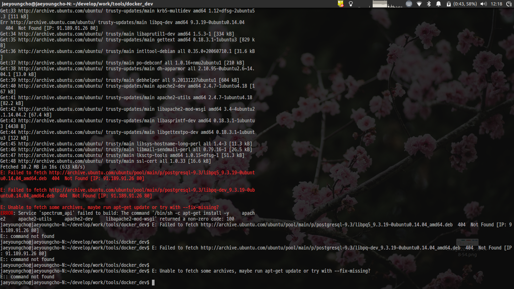

# E: Unable to fetch some archives, may run apt-get update or try with --fix-missing?

Ubuntu 14.04를 Base Image로하여 개발환경을 만들어 운영 중이었는데, 추가적으로 설치해야하는 Package(vue-cli)가 있어서 Dockerfile을 수정하였다.
수정 후 다음 command를 통해 개발환경을 새로 빌드 후 Container를 시작시키고자 하였다. 

> $ sudo docker-compose up --build -d

그런데 이때 다음과 같은 오류가 발생하였다. 

## Reason

**원인이 무엇인지는 파악하지 못했다 ..**
추후 시간적 여유가 있을때 원인을 파악하기로하고 우선 차선적인 해결책을 찾았다. 

## Solution

원인을 파악하지는 못했으나, 문제를 해결하기 위해서 다음 과정을 살펴보았다.

우선 Ubuntu 14.04 이미지를 통해 Container를 하나 만들고 Dockerfile에 작성 된 순서대로 개발환경을 구축해보았다.
이떄는 정상적으로 설치가 완료된다. 

따라서 Ubuntu 14.04와 이를 통해 작성 된 이미지들을 모두 지우고 다시 설치한 후 다음 명령을 통해 개발환경을 로드해보았다.

> $ sudo docker-compose up -d

정상적으로 개발환경이 잘 로드되었다.

