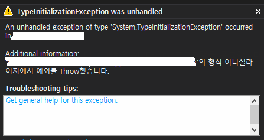
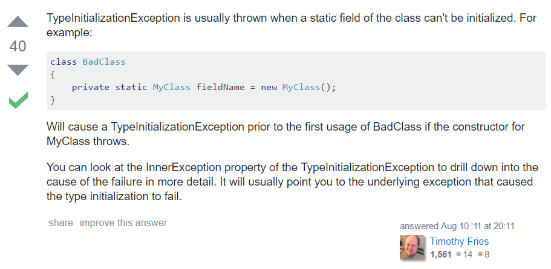
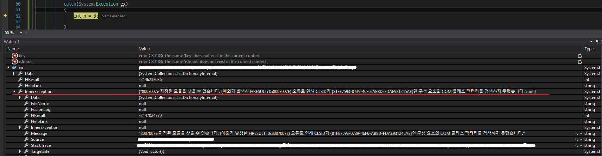

# TypeInitializationException was unhandled

빌드는 정상적으로 수행했는데, 실행 시 'TypeInitializationException'가 발생하였다.

검색을 해보니 ... StackOverflow에 [TypeInitializationException exception on creating an object](http://stackoverflow.com/questions/7017043/typeinitializationexception-exception-on-creating-an-object)라는 글이있다. 나와 같은 상황으로 답변은 다음과 같다.

답변에 따라 해당 예외를 try-catch를 통해서 잡고 InnerException을 확인해보았더니 예외의 원인이 자세히 나온다.

## 참조

* [TypeInitializationException exception on creating an object](http://stackoverflow.com/questions/7017043/typeinitializationexception-exception-on-creating-an-object)
