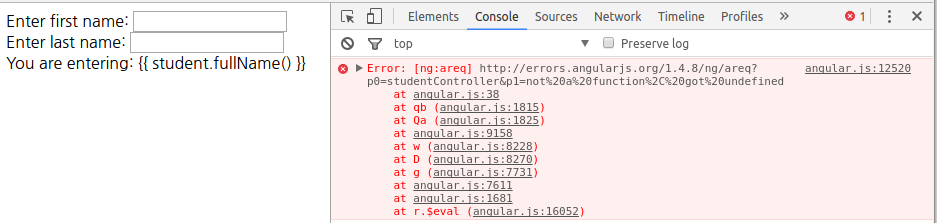
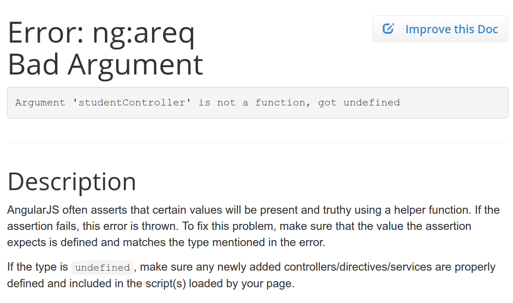

# Error: ng:areq Bad Argument

## 개발 환경

* Ubuntu 14.04
* PyCharm 2016.3.2
* Angular.js 1.4.8

## 개요

[tutorialspoint, AngularJS - Controller](https://www.tutorialspoint.com/angularjs/angularjs_controllers.htm)의 내용을 따라하던 중, Example단락 이전까지만
읽고 코드를 다음과 같이 작성하였다.

[problem.html](./src/problem.html)

```html
<!DOCTYPE html>
<html lang="en">
<head>
    <meta charset="UTF-8">
    <title>Problem</title>
    <script src="https://ajax.googleapis.com/ajax/libs/angularjs/1.4.8/angular.min.js"></script>
    <script>
       function studentController($scope) {
          $scope.student = {
             firstName: "Mahesh",
             lastName: "Parashar",

             fullName: function() {
                var studentObject;
                studentObject = $scope.student;
                return studentObject.firstName + " " + studentObject.lastName;
             }
          };
       }
    </script>
</head>
<body>
    <div ng-app = "" ng-controller = "studentController">
        Enter first name: <input type="text" ng-model="student.firstName"><br />
        Enter last name: <input type="text" ng-model="student.lastName"><br />
        You are entering: {{ student.fullName() }}
    </div>
</body>
</html>
```

위 코드를 보면 Angular의 Controller를 Application에 등록하고 있지 않다. 위 코드를 실행해보면 다음과 같은 오류가 발생한다.



## 해결


studentController의 속성들이 화면에 출력되지 않고, Chrome의 Console화면을 보면 에러메시지가 나타나있다.
위 에러 메시지의 링크를 따라가 보면 다음과 같은 메시지가 출력된다.



위 내용으로 추측해보면 아무래도 Controller가 옳바르게 정의되지 않은 것 같다. 따라서, 튜토리얼의 내용을 좀 더 읽어보았더니
역시, Controller를 Application에 등록해주어야했다.

[solve](./src/solve.html)

```html
<!DOCTYPE html>
<html lang="en">
<head>
    <meta charset="UTF-8">
    <title>Solve</title>
    <script src="https://ajax.googleapis.com/ajax/libs/angularjs/1.4.8/angular.min.js"></script>
    <script>
       function studentController($scope) {
          $scope.student = {
             firstName: "Mahesh",
             lastName: "Parashar",

             fullName: function() {
                var studentObject;
                studentObject = $scope.student;
                return studentObject.firstName + " " + studentObject.lastName;
             }
          };
       }

       <!-- 1. Application에 Controller를 추가하는 코드 추가 -->
       const mainApp = angular.module('mainApp', []);
       mainApp.controller('studentController', studentController);
    </script>
</head>
<body>
    <!-- 2. ng-app 지시자에 mainApp설정하는 코드 추가 -->
    <div ng-app = "mainApp" ng-controller = "studentController">
        Enter first name: <input type="text" ng-model="student.firstName"><br />
        Enter last name: <input type="text" ng-model="student.lastName"><br />
        You are entering: {{ student.fullName() }}
    </div>
</body>
</html>
```

## 참고

* [tutorialspoint, AngularJS - Controller](https://www.tutorialspoint.com/angularjs/angularjs_controllers.htm)
* [Error: ng:areq Bad Argument](https://docs.angularjs.org/error/ng/areq?p0=studentController&p1=not%20a%20function,%20got%20undefined)
