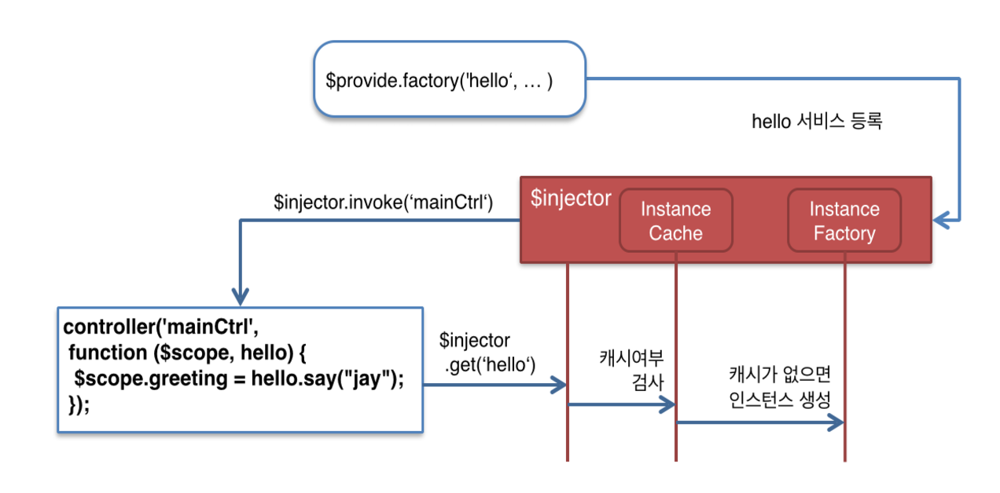

# AngularJS의 서비스 생성, 등록 및 DI되는 과정 이해하기

다음 그림은 AngularJS에서 $Provider를 통해 서비스를 생성하고 $Injector에 등록한 뒤 Controller에 $Injector에 등록한 서비스가 DI되는 과정을 나타내고 있다. 여기서는 Controller에 대한 DI만 나타내고 있지만, $Injector에 등록 된 서비스가 DI되는 대상은 directive, service, factory 등이 될 수 있다.

$Injector는 Module 내에서 $Provider를 통해 생성되는 모든 서비스를 등록 관리한다. $Provider는 이러한 서비스를 생성하여 $Injector에 등록하는 일을 하며, 우리는 Module.factory, Module.service 등의 $Provider의 메소드들에 대한 참조를 사용하고 있었으므로 실제로 $Provider를 사용해서 개발하지는 않는다.

서비스가 $Injector에 등록된 후 인스턴스화 되면 Cache가 된다. 따라서 Singleton으로 관리된다.

다음은 위 Workflow에 대한 순서별 설명이다.

1. hello factory를 생성한다.
2. hello factory를 $Inejctor에 등록한다.
3. mainCtrl를 생성한다.
4. mainCtrl에 hello factory를 $Injector를 통해서 가져온다.
5. $Injector는 hello factory가 캐쉬되어 있는지 확인한 후 캐쉬되어 있다면 캐쉬된 hello factory instance를 반환한다. 그렇지 않으면 hello factory instance를 생성한 후 Cache한 후 반환한다. 

## 참조

* [서비스 개발을 위한 의존관계 주입 알아보기](http://webframeworks.kr/tutorials/angularjs/dependency_injection_with_angularjs/)
