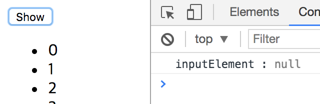
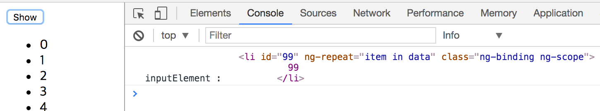

# $timeout을 이용한 화면 rendering 대기

우선 다음 코드를 보자. 다음 코드가 의도하는 것은 'Show' 버튼을 클릭하였을 때, $scope.data 배열에 저장되어 있는 데이터를 li 태그를 통해 출력한 후 99번째 출력 된 엘리먼트를 찾아서 출력하고자 한 것이다.  

```html
<!DOCTYPE html>
<html lang="en">
<head>
    <meta charset="UTF-8">
    <title>orderBy asc, desc</title>
    <script src="https://ajax.googleapis.com/ajax/libs/angularjs/1.6.4/angular.min.js"></script>
    <script>
        var app = angular.module("app", []);

        app.controller('ctrl', function($scope, $timeout) {
          $scope.value = 100;
          $scope.isShow = false;

          $scope.data = [];
          for(var i=0; i<100; i++) {
            $scope.data.push(i);
          }

          $scope.show = function() {
            $scope.isShow = true;

            var inputElement = document.getElementById('99');
            console.log('inputElement :', inputElement);
          }
        });
    </script>
</head>
<body>
    <div ng-app="app" ng-controller="ctrl">
      <button ng-click='show()'>Show</button>
      <br />
      <ul ng-if='isShow'>
       <li id='{{item}}' ng-repeat='item in data'>
         {{item}}
       </li>
      </ul>
    </div>
</body>
</html>
```

다음은 위 코드를 실행시켰을 때의 결과이다. 불행히도 다음 코드는 의도한데로 동작하지 않았다.



왜 의도한데로 동작하지 않은걸까? 다시 코드를 살펴보자. **$scope.isShow에 true가 할당되는 순간 AngularJS는 $scope.isShow가 Binding 되어 있는 DOM을 랜더링하기 시작한다. 하지만 불행히도 랜더링이 완료되기 전 docuemnt.getElementById('99') 코드가 실행되고, 결국 원하는 결과는 얻지 못한것이다.**

```javascript
$scope.show = function() {
  $scope.isShow = true;

  var inputElement = document.getElementById('99');
  console.log('inputElement :', inputElement);
}
```

결국 **DOM이 랜더링 된 후 document.getElementById('99')가 호출 된다면** 원하는 결과를 얻을 수 있을 것이다. 어떻게 하면 DOM의 랜더링이 완료되는 것을 대기할 수 있을까? 위 코드를 다음과 같이 수정한 후 실행해보자.

```javascript
$scope.show = function() {
  $scope.isShow = true;

  $timeout(function() {
    var inputElement = document.getElementById('99');
    console.log('inputElement :', inputElement)
  });
}
```

다음은 위 코드의 실행 결과이다. 결과를 보면 의도한데로 잘 동작하였다.  



의도한데로 동작했던 코드와 그렇지 않은 코드의 유일한 차이점은 **$timeout 서비스의 사용 유무**이다.
우선, $timeout 함수의 원형을 보자.  

```javascript
$timeout(fn, delay, invokeApply)
```

위 코드에서 나는 $timeout 서비스에서 callback function만을 전달하고 나머지 인자는 전달하지 않았다. 여기서 주목할 인자는 delay인데, 아무것도 전달하지 않으면 0으로 설정된다. **이렇게 되면 화면에서 DOM 랜더링이 시작되었을 때 랜더링이 끝날 때 까지 JavaScript 코드는 대기하게 된다.**

### 결론

앞선 코드와 같이 화면이 랜더링 된 후 JavaScript 코드가 실행 될 필요가 있을 때는 $timeout 서비스의 delay 인자에 0을 전달하면 된다.
참고로 **$timeout 서비스는 window.setTimeout method의 wrapper로 $timeout 대신 window.setTimeout을 사용해도 된다.**

## 참조

* [Why is setTimeout(fn, 0) sometimes useful?](https://stackoverflow.com/questions/779379/why-is-settimeoutfn-0-sometimes-useful#comment14183689_779785)
* [쉽지만 쉽지만은 않은 $timeout 서비스](http://programmingsummaries.tistory.com/348)
