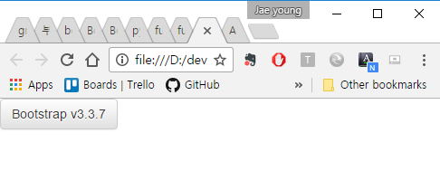
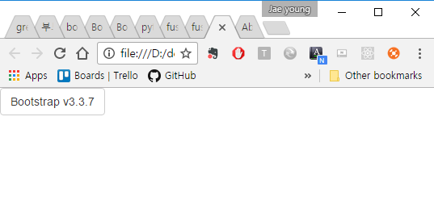

# 버튼이 플랫하게 출력되지 않음

## 개발 환경

* Windows 10 64bit
* Chrome Version 55.0.2883.87 m (64-bit)
* Bootstrap v3.3.7
* ATOM 1.13.0

## 개요

Bootstrap을 통해 UI를 개발하던 중 콤포넌트들이 플랫하게 나오길 바랬는데 볼륨이 들어가서 출력되었다.
예를들면 다음과 같이.



코드는 다음과 같다.

```html
<!DOCTYPE html>
<html lang="en">
<head>
  <meta charset="utf-8">
  <title>Test</title>
  <!-- Latest compiled and minified CSS -->
  <link rel="stylesheet" href="https://maxcdn.bootstrapcdn.com/bootstrap/3.3.7/css/bootstrap.min.css">
  <!-- Optional theme -->
  <link rel="stylesheet" href="https://maxcdn.bootstrapcdn.com/bootstrap/3.3.7/css/bootstrap-theme.min.css">
</head>
<body>
  <a class="btn btn-default">Bootstrap v3.3.7</a>
</body>
</html>
```

## 해결

[Bootstrap 3 buttons - not flat?](http://stackoverflow.com/questions/29334148/bootstrap-3-buttons-not-flat/29334210)을 보면 **bootstrap-theme.css** 파일이 콤포넌트에 볼륨을 넣는다고 한다. 따라서 위 코드에서 이 부분을 삭제하였더니 원하는데로 출력되었다.



코드는 다음과 같다.

```html
<!DOCTYPE html>
<html lang="en">
<head>
  <meta charset="utf-8">
  <title>Test</title>
  <!-- Latest compiled and minified CSS -->
  <link rel="stylesheet" href="https://maxcdn.bootstrapcdn.com/bootstrap/3.3.7/css/bootstrap.min.css">
  <!-- Optional theme -->
  <link rel="stylesheet" href="https://maxcdn.bootstrapcdn.com/bootstrap/3.3.7/css/bootstrap-theme.min.css">
</head>
<body>
  <a class="btn btn-default">Bootstrap v3.3.7</a>
</body>
</html>
```

## 참고

* [Bootstrap 3 buttons - not flat?](http://stackoverflow.com/questions/29334148/bootstrap-3-buttons-not-flat/29334210)
