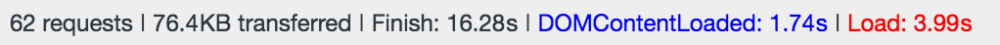

# DOMContentsLoaded vs Load

## 개요

Chrome의 개발자 도구의 Network탭을 보면 하단에 다음 그림과 같이 DOMContentsLoaded와 Load에 각각 시간이 표시되어있다. 

각각 DOM의 Event들인데 DOMContentsLoaded이벤트와 Load이벤트의 차이점에 대해서 알아보자.

## [DOMContentsLoaded](https://developer.mozilla.org/en-US/docs/Web/Events/DOMContentLoaded)

[DOMContentsLoaded](https://developer.mozilla.org/en-US/docs/Web/Events/DOMContentLoaded)이벤트는 오직 HTML 문서가 완전히 로드되고 파싱되었을 때 발생한다. 따라서, Chrome의 DOMContentsLoaded 이벤트의 소요시간을 확인하면 순수하게 HTML 문서의 출력 소요시간을 알 수 있다.
다시 말해서, stylesheet, image, subframe 등의 로드에 대해서는 고려되지 않으므로 해당 이벤트를 통해서는 화면의 모든 요소들이 모두 로드되었는지 알 수 없다.

## [load](https://developer.mozilla.org/en-US/docs/Web/Events/load)

[load](https://developer.mozilla.org/en-US/docs/Web/Events/load)이벤트는 HTML, stylesheet, image, subframe 등 화면의 모든 요소가 로드되었을 때 발생한다. 따라서, Chrome의 Load 이벤트의 소요시간을 확인하면 화면의 모든 요소가 로드되는데 걸리는 시간을 알 수 있다. 

## 참조

* [DOMContentsLoaded](https://developer.mozilla.org/en-US/docs/Web/Events/DOMContentLoaded)
* [load](https://developer.mozilla.org/en-US/docs/Web/Events/load)

