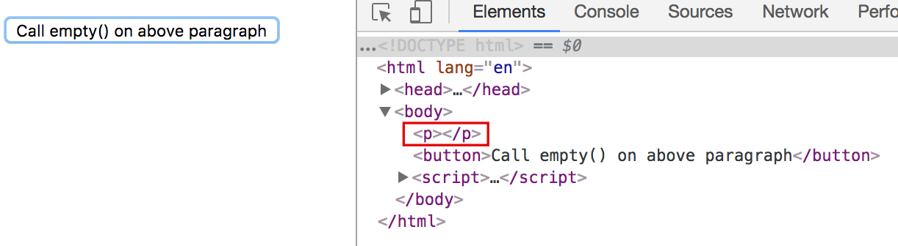

# About empty method of jQuery

empty method는 selector를 통해 찾은 element의 모든 child element들을 제거한다. **여기서 주의해야 할 것은 selector를 통해 찾은 element는 삭제하지 않는다는 것이다.**
이때, 각 element들 안에 존재하는 text들도 함께 삭제되는데, 이는 empty method가 DOM specification을 따르기 때문이다. **DOM specification에 따르면 "element 안에 있는 어떤 형태의 text든 모두 child element로 간주한다."라고 되어있다.**    

empty method가 실행될 때 jQuery는 memory leak을 피하기 위해서 element들을 삭제하기 전에 각 element에 할당 된 data 또는 event handler와 같은 construct들을 삭제한다.  
만약, element와 함께 삭제되는 data 또는 event handler와 같은 construct들을 지우지 않고 element들만을 삭제하길 원한다면 [.detach()](https://api.jquery.com/detach/)를 사용하도록 한다. [.detach()](https://api.jquery.com/detach/)는 나중에 해당 지워진 element를 다시 DOM에 추가할 때 유용하다.  

다음은 empty method를 사용하는 예제이다.

```html
<!doctype html>
<html lang="en">
<head>
  <meta charset="utf-8">
  <title>empty demo</title>
  <style>
    p {
      background: yellow;
    }
  </style>
  <script src="https://ajax.googleapis.com/ajax/libs/jquery/3.1.1/jquery.min.js"></script>
  <script>
    $(document).ready(function () {
      $("button").click(function() {
        $("p").empty();
      });
    });
  </script>
</head>
<body>
<p>
  Hello, <span>Person</span> <em>and person</em>.
</p>
<button>Call empty() on above paragraph</button>
</body>
</html>
```

## Conclusion

다음은 empty 메소드를 호출하기 전 inspector 캡처화면이다. 


다음은 empty 메소드를 호출한 후 inspector 캡처화면이다.  
앞서 설명한바와 같이 selector를 통해 찾은 p 태그를 제외한 모든 child elements가 삭제된 것을 확인 할 수 있으며, text 역시 child element로 간주되기 때문에 삭제된 것을 확인 할 수 있다. 



## 참조

* [.empty()](https://api.jquery.com/empty/)
