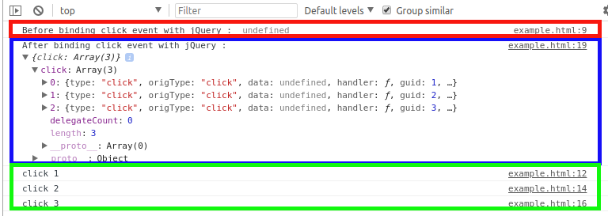

# How to find evetns bound to an element with jQuery

#### Requirement

* jQuery 3.1.1

jQuery의 event bind 메소드를 통해 bind된 이벤트를 찾는 방법에 대해서 알아보자. 

* .bind() *As of jQuery 3.0 has been deprecated. It was superseded by the .on() method since jQuery 1.7*
* .delegate()*As of jQuery 3.0 has been deprecated. It was superseded by the .on() method since jQuery 1.7*
* .live() *As of jQuery 1.7 has been deprecated and As of jQuery 1.9 has been removed. It was superseded by the .on() method since jQuery 1.7*
* .on()

## Example

다음 예제를 보자.  
button element에 click event를 3개 bind하기 전, bind된 event object를 출력하고 bind한 후 bind 된 event object를 출력하고 있다. 

```javascript
<!doctype html>
<html lang="en">
<head>
    <meta charset="utf-8">
    <title>bind demo</title>
    <script src="https://ajax.googleapis.com/ajax/libs/jquery/3.1.1/jquery.min.js"></script>
    <script>
        $(function() {
            console.log('Before binding click event with jQuery : ', $.data($('button')[0], 'events'));

            $('button').on('click', function() {
                console.log('click 1');
            }).on('click', function() {
                console.log('click 2');
            }).on('click', function() {
                console.log('click 3');
            });            

            console.log('After binding click event with jQuery : ', $.data($('button')[0], 'events'));
        });
    </script>
</head>

<body>
    <button>Click</button>
</body>
</html>
```

## Output

위 예제의 출력결과는 다음과 같다.  
다음 출력결과의 색으로 표시 된 박스가 의미하는 바는 다음과 같다. 

* Red : Before binding event
* Blue : After binding event
* Green: Click button



## About .data() method

앞서 button element에 bind된 event object를 확인하기 위해서 사용한 .data() method는 일반적으로 특정 element에 개발자가 특정 데이터를 저장하여 관리하기 위해 사용한다.  
하지만, jQuery는 이 메소드를 event handler와 같이 jQuery를 동작시키기 위한 내부적인 데이터를 저장하는 용도로도 사용한다.  
따라서 앞선 예제에서 이 메소드를 사용해서 button element에 bind된 event object를 확인하였다. 

## Reference

* [How to Find Events Bound To An Element With jQuery](https://paulund.co.uk/events-bound-to-element-jquery)
* [.data()](https://api.jquery.com/jquery.data/)