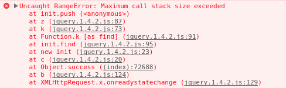

# Uncaught RangeError: maximum call stack size exceeded

jQuery를 통해 화면에 80000개의 option 태그를 생성한 후 출력된 option태그를 지우는 코드를 실행하였는데 다음과 같은 오류가 발생하였다. 



코드는 다음과 같다. 

```javascript
// Making select tag and option tags
var options = '';
for(var i=0; i<80000; i++) {
    options += '<option value="'+i+'">'+i+'</option>'
}   
$("select").append(options); 

// Removing option tags
$("button").click(function() {
    var select = $("select");
    var options = $("option", select); // When this line called, Uncaught RangeError occure.
    if(options) {
        options.remove();
    }
});
```

**Uncaught RangeError: maximum call stack size exceeded** 에러가 발생한 위치는 다음 코드이다. 

```javascript
var options = $("option", select);
```


해당 코드는 앞서 찾은 <select> 태그의 모든 <option> child elements를 찾는 코드인데, child elements 마다 jQuery instance를 생성하여 Stack에 저장한다.
따라서 8만개의 jQuery instance를 메모리에 올릴 수 없기 때문에 발생하는 이슈.

이 문제를 해결하기 위해서는 <select>태그의 모든 <option>의 jQuery instance를 얻어오는 것이 아니라, <select>태그에 대한 jQuery instance에서 모든 child elements를 바로 삭제해주면 된다. 
다음과 같이 처리하면 memory 이슈 없이 잘 삭제되는것을 확인할 수 있다. 

```javascript
// Removing option tags
$("button").click(function() {
    $("select").empty('option');
    // var options = $("option", select); // When this line called, Uncaught RangeError occure.
    // if(options) {
    //     options.remove();
    // }
});