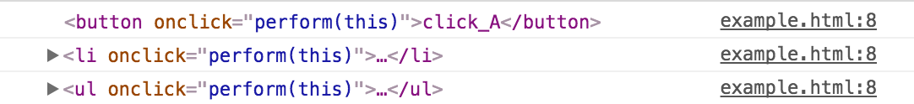

# event.stopPropagation()에 대해서

**event.stopPropagation()**은 특정 엘리먼트에서 특정 이벤트가 발생하였을 때, **해당 이벤트가 상위 엘리먼트로 전파되는 것을 막는다**.
이벤트가 상위 엘리먼트로 전파된다는 것이 무슨 말일까?

예를들어, 다음과 같은 html이 있다고 가정하자.
ul 엘리먼트을 포함하여 차일드 엘리먼트들 모두 onclick 이벤트가 발생하면 해당 엘리먼트를 console.log를 통해 출력하도록 하였다.
이때, click_A 버튼을 클릭하며 click_A 버튼의 onclick 이벤트만이 발생하는 것이 아니라 최상위 엘리먼트까지의 모든 onclick 이벤트가 발생한다.

```html
<!doctype html>
<html lang="en">
<head>
  <meta charset="utf-8">
  <title></title>
  <script>
    function perform(obj) {
      console.log(obj);
    }
  </script>
</head>
<body>
  <div>
    <ul onclick='perform(this)'>
      <li onclick='perform(this)'>
        <button onclick='perform(this)'>click_A</button>
        <button onclick='perform(this)'>click_B</button>
      </li>
    </ul>
  </div>
</body>
</html>
```

다음은 click_A 버튼을 클릭하였을때의 결과이다.
상위 li 엘리먼트와 최상위 ul 엘리먼트의 onclick 이벤트가 차례로 발생했음을 알 수 있다. 이를 **Event Bubble Up**이라고 한다.
**주의할 점은 이벤트는 상위 엘리먼트들로 전파 될 뿐 형제 엘리먼트나 하위 엘리먼트로는 전파되지 않는다.**



그러면, event.stopPropagation()을 이용해서 이벤트가 상위로 전파되지 않도록 막아보자. 위 예제를 다음과 같이 수정하였다.

```html
<!doctype html>
<html lang="en">
<head>
  <meta charset="utf-8">
  <title></title>
  <script>
    function perform(obj) {
      console.log(obj);
    }
    function performWithStopPropagation(obj) {
      event.stopPropagation();
      console.log(obj);
    }
  </script>
</head>
<body>
  <div>
    <ul onclick='perform(this)'>
      <li onclick='perform(this)'>
        <button onclick='performWithStopPropagation(this)'>click_A</button>
        <button onclick='perform(this)'>click_B</button>
      </li>
    </ul>
  </div>
</body>
</html>
```

다음은 event.propagation()가 적용된 이벤트 헨들러를사용하는 click_A 버튼을 클릭했을 때의 결과이다.
더 이상 상위 엘리먼트로의 Event Bubble Up이 발생하지 않음을 확인할 수 있다.


번외로, 서로 다른 이벤트들 끼리도 Event Bubble Up이 발생하는지 궁금해져서 확인해봤다.
방금 사용헀던 예제에 textbox를 추가하고 keypress 이벤트 핸들러를 작성하였다.

```html
<!doctype html>
<html lang="en">
<head>
  <meta charset="utf-8">
  <title></title>
  <script>
    function perform(obj) {
      console.log(obj);
    }
    function performWithStopPropagation(obj) {
      event.stopPropagation();
      console.log(obj);
    }
  </script>
</head>
<body>
  <div>
    <ul onclick='perform(this)'>
      <li onclick='perform(this)'>
        <button onclick='performWithStopPropagation(this)'>click_A</button>
        <button onclick='perform(this)'>click_B</button>
        <input type='text' onkeypress='perform(this)'/>
      </li>
    </ul>
  </div>
</body>
</html>
```

다음은 위 코드의 실행 결과로 처음 textbox를 클릭했을 때는 onclick 이벤트가 발생하므로 Event Bubble Up이 발생했음을 알 수 있다. 하지만 키 입력을 수행하여 keypress 이벤트가 발생했을 때는 더 이상 Event Bubble Up이 발생하지 않음을알 수 있다.
따라서, **서로 다른 이벤트 사이에서는 Event Bubble Up이 발생하지 않음을 알 수 있다.**

## 참조

* [event.stopPropagation(), event.preventDefault () 이해하기](http://ismydream.tistory.com/98)
