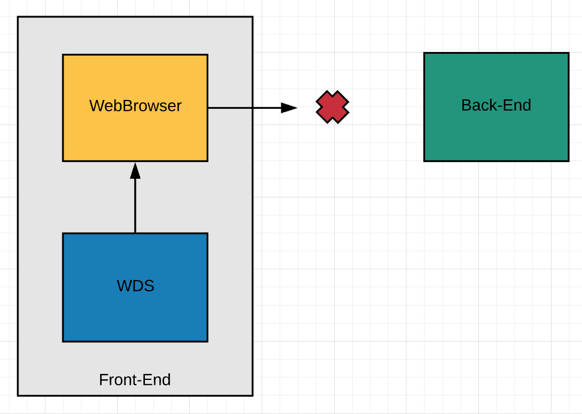
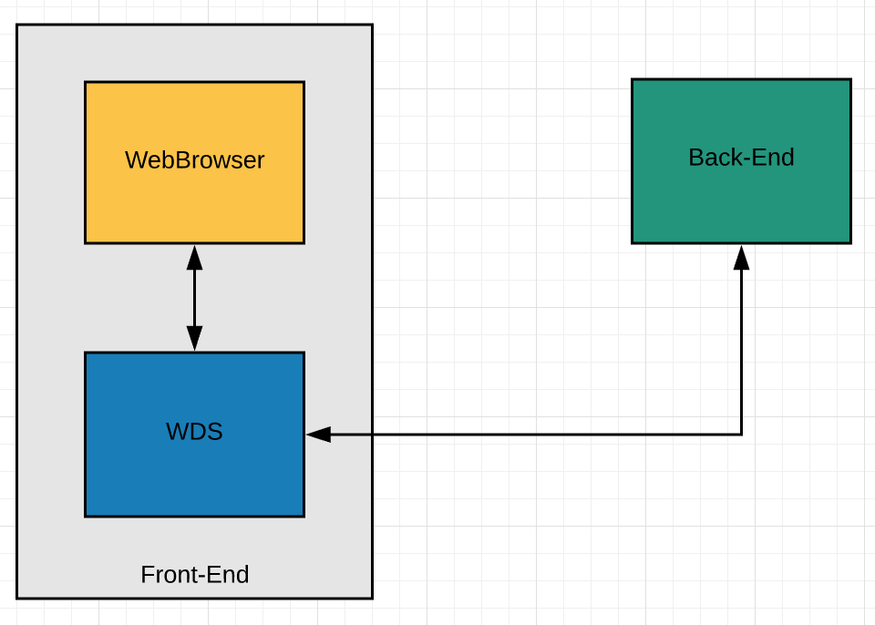

# Webpack-Dev-Server with real backend

webpack-dev-server(이하 WDS)에서 API Proxing을 하는 방법에 대해서 알아본다. 

## Problem

Vue.js를 통해 Front-End 개발 시 여러가지 편의를 위해 WDS를 사용한다. 그리고 화면에 동적인 데이터를 출력하기 위해서는 개발 또는 운영환경의 Back-End에서 제공하는 API를 호출해야한다.  
하지만, 이러한 호출은 WDS를 통해 서빙되고 있는 Front-End의 Host와 Back-End의 Host 정보가 다르기 때문에 [same-origin policy restricts](https://developer.mozilla.org/en-US/docs/Web/Security/Same-origin_policy)에 의해 웹 브라우저가 막아버린다. 



다음은 위와같은 경우 웹 브라우저에서 출력하는 에러이다. 


## Solution

따라서, 위와 같은 문제를 해결하기 위해서는 WDS의 API Proxing을 이용해야한다. 
다음 그림과 같이 WebBrowser에서 직접 Back-End API를 호출하는 것이 아니라 WDS를 통해 Back-End API를 호출하는 것이다. 



예를들어, 'Hello World!'라는 response를 주는 api/hello라는 Back-End API가 있다고 가정하자.  
이 API를 호출하기 위해서는 우선 vue.js의 config/index.js파일의 dev.proxyTable을 다음과 같이 수정해주어야한다. 

```javascript
proxyTable: {
    '/api': {
        target: 'http://localhost', // Back-End의 주소를 입력해주면 된다. 본 예제에서는 localhost에 Back-End가 존재하므로 localhost로 작성하였다. 
        changeOrigin: true
    },
},
```

위 설정은 /api로 시작되는 API 호출의 경우 **target**에 작성된 Back-End로 요청을 보낸다는 것이다. 
**changeOrigin**은 **target**에 지정 된 Back-End가 [name-based virtual hosted sites](https://en.wikipedia.org/wiki/Virtual_hosting#Name-based)인 경우 반드시 **true**로 설정해주어야한다. 본 문서의 예제에서는 true로 설정해놓았지만, 예제에서 제공되는 Back-End가 [name-based virtual hosted sites](https://en.wikipedia.org/wiki/Virtual_hosting#Name-based)가 아니기 때문에 false로 지정해도 문제없이 동작하며 이 값이 default 설정이기도 하다. 

위와 같이 설정을 마친 후 component에서 /api/hello API를 호출해주는 코드를 작성하면 된다. 

```javascript
methods: {
    getHome: function() {
      axios.get('/api/hello')
      .then(res => {
        console.log('---------- response');
        console.log(res.status);
        console.log(res.data);

        this.name = res.data

      }).catch(ex => {
        console.log('------- catch');
        console.error(ex.toString());
      });
    }
  }
```

## Reference

* [How to setup Vue dev server with a running Web Server](https://medium.com/@FrancescoZ/how-to-setup-vue-dev-server-with-a-running-web-server-7532c53b3198)
* [Using webpack-dev-server](https://webpack.js.org/guides/development/#using-webpack-dev-server)
* [API Proxying During Development](https://github.com/vuejs-templates/webpack/blob/develop/docs/proxy.md)