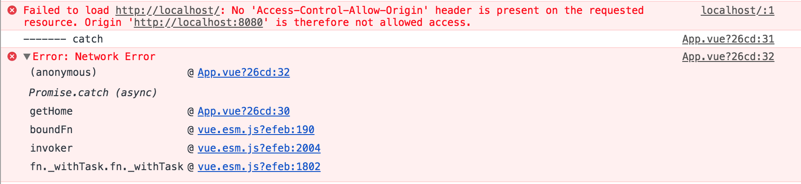

# Webpack-Dev-Server with real backend

webpack-dev-server(이하 WDS)에서 API Proxing을 하는 방법에 대해서 알아본다. 

## Problem

Vue.js를 통해 Front-End 개발 시 여러가지 편의를 위해 WDS를 사용한다. 그리고 화면에 동적인 데이터를 출력하기 위해서는 리얼환경이던 개발환경이던 Back-End에서 제공하는 API를 호출해야한다. 
하지만, 이러한 호출은 WDS를 통해 서빙되고 있는 Front-End의 Host와 Back-End의 Host 정보가 다르기 때문에 [same-origin policy restricts](https://developer.mozilla.org/en-US/docs/Web/Security/Same-origin_policy)에 의해 웹 브라우저가 막아버린다. 

다음은 위와같은 경우 웹 브라우저에서 출력하는 에러이다. 

## Solution

따라서, 위와 같은 문제를 해결하기 위해서는 WDS의 API Proxing을 이용해야한다. 

## Reference

* [How to setup Vue dev server with a running Web Server](https://medium.com/@FrancescoZ/how-to-setup-vue-dev-server-with-a-running-web-server-7532c53b3198)
* [Using webpack-dev-server](https://webpack.js.org/guides/development/#using-webpack-dev-server)
* [API Proxying During Development](https://github.com/vuejs-templates/webpack/blob/develop/docs/proxy.md)