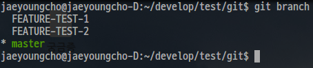
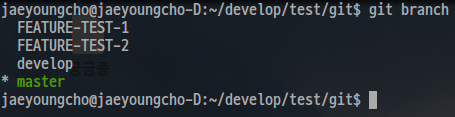
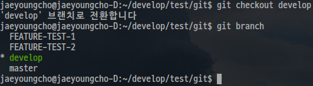
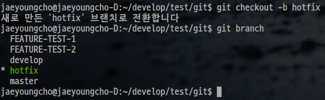
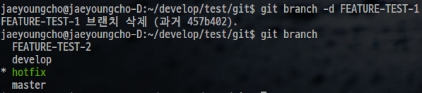
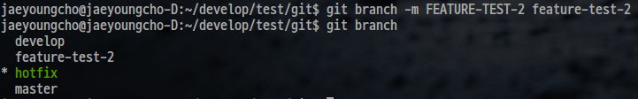
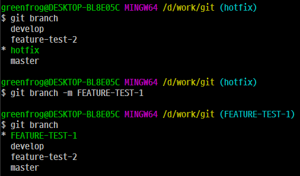

# branch

## 개요

git에서 branch를 사용하는 방법에 대해서 알아본다. 

## 브랜치 목록 확인하기

현재 repository에 존재하는 브랜치 목록을 확인하기 위해서는 다음 명령을 사용한다. 

```
$ git branch
```

[출력 결과]



위 출력 결과를 보면 총 3개의 브랜치가 존재한다. 첫번째는 master 브랜치이고, 나머지 두개 브랜치는 feature 브랜치이다. 
이때, 현재 사용중인 브랜치 앞에는 '*'가 붙는다. 따라서, 현재 사용 중인 브랜치는 master이다. 

## 새로운 브랜치 만들기

현재 작업 중인 브랜치에서 새로운 브랜치를 만들려면 다음 명령을 사용한다. 

```
$ git branch <new branch name>
```

위 명령을 통해서 develop 브랜치를 만들어보자. 

```
$ git branch develop
```

[출력 결과]



위 명령을 수행한 후, git branch 명령을 통해서 현재 repository에 존재하는 브랜치 목록을 확인하면 위 그림과 같이 develop 브랜치가 생성된 것을 확인할 수 있다. 

## 특정 브랜치로 이동하기

앞서 설명한 git branch <new branch name> 명령의 수행 결과를 보면 여전히 master 브랜치를 사용하고 있다고 나타난다. 그러면 방금 만든 develop 브랜치를 사용하고자 한다면 어떻게 해야할까?

특정 브랜치를 사용하고자 할 때는 다음 명령을 사용한다. 

```
$ git checkout <branch name>
```

그러면 위 명령을 통해서 develop 브랜치를 사용해보자. 

```
$ git checkout develop
```

[출력 결과]



위 명령의 수행 결과를 보면 해당 develop 브랜치로 이동 되었음을 알려준다. git branch 명령의 결과를 보아도 '*'가 develop 브랜치 앞으로 이동한것을 확인할 수 있다. 

## 새로운 브랜치 생성과 이동을 함께하기

그러면, 새로운 브랜치를 생성함과 동시에 생성된 브랜치로 이동할 수 있는 방법은 없을까? git checkout 명령에 -b 옵션을 주면 가능하다. 

```
$ git checkout -b <new branch name>
```

위 명령을 사용해서 hotfix 브랜치를 만들고 바로 해당 브랜치로 이동해보자.

```
$ git checkout -b hotfix
```
[출력 결과]



앞서 브랜치의 위치가 develop이었는데, 위 명령을 수행 결과를 보면 hotfix 브랜치를 생성하고 해당 브랜치로 바로 이동했음을 확인 할 수 있다. 

## 특정 브랜치 삭제하기

이제 필요없는 브랜치를 삭제해보자. 다음 명령을 통해 필요없는 브랜치를 삭제할 수 있다. 

```
$ git branch -d <branch name>
```

위 명령을 사용해서 FEATURE-TEST-1를 삭제해보자.

```
$ git branch -d FEATURE-TEST-1	
```

[출력 결과]



## 브랜치 이름 변경하기

이번에는 브랜치 이름을 바꿔보자. 다음 명령을 사용하면 된다. 

```
$ git branch -m <branch name> <new branch name>
```

위 명령을 통해서 FEATURE-TEST-2 브랜치의 이름을 feature-test-2로 변경해보자.

```
$ git branch -m FEATURE-TEST-2 feature-test-2
```

[출력 결과]



현재 브랜치의 이름을 바꿀 때는 다음 명령을 사용한다. 

```
$ git branch -m <branch name>
```

현재 브랜치인 hotfix 브랜치의 이름을 FEATURE-TEST-1으로 변경해보자.

```
$ git branch -m FEATURE-TEST-1
```

[출력 결과]




## 참고

* [브랜치 생성과 체크아웃](https://mylko72.gitbooks.io/git/content/branch/checkout.html)


 


