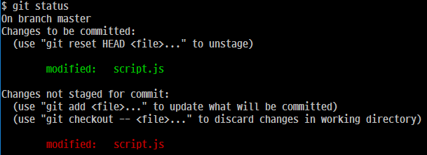
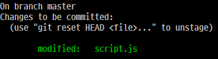
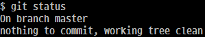
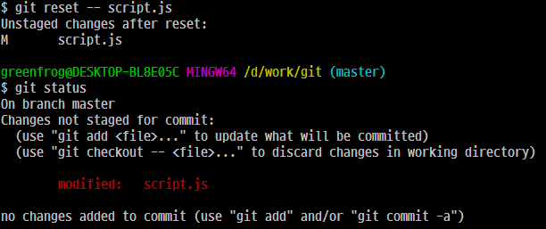

# 파일 복원

> git version 2.10.2.windows.1

## 작업 디렉토리에 대한 파일 복원 

### git checkout -- <file>

다음 그림과 같이 해당 파일이 stage area에 커밋을 대기중일 때, 다시 해당 파일을 변경하게 되면 작업 디렉토리에 추가된다. 

이때, 변경된 파일을 취소하고 싶다면 다음 명령을 사용한다. 

> git checkout -- script.js

위 명령을 사용하면 다음 그림과 같이, stage area에서 커밋을 대기하고 있는 파일에는 변경이 없고 오직 작업 디렉토리에 추가된 파일만 취소된다. 

만약, 작업 디렉토리 파일이 여러개 있을 경우 모든 파일을 취소하고 싶다면 다음과 같이 하면 된다.

> git checkout -- *

또는 특정 파일만을 취소하고 싶다면 다음과 같이 하면 된다. 

> git checkout -- *.js

### git checkout HEAD <file>

다음 그림과 같이 파일이 stage area와 작업 디렉토리에 추가되어 있다고 하자. 

이를 한꺼번에 취소하고 싶다면 다음 명령을 사용한다. 

> git checkout HEAD script.js

위 명령의 결과는 다음 그림과 같다. stage area와 작업 디렉토리에 추가되어 있던 script.js파일이 모두 취소되었다. 
만약, 여러개의 파일이 stage area에 있고 작업 디렉토리에 있다하더라도 오직 인자로 전달한 파일에 대해서만 명령을 수행한다. 

혹여나 다음과 같이 명령을 내려서 위와 동일한 효과를 기대한다면 오산이다. 옳바르게 동작하지 않는다. 

> git checkout HEAD

## Stage Area에 대한 파일 복원 

### git reset -- <file>

다음 그림과 같이 같은 파일이 stage area 및 작업 디렉토리에 추가되어 있다고 하자.

stage area에서 커밋을 대기중인 파일만 취소하고자 한다면 다음 명령을 사용한다. 

> git reset -- script.js

위 명령을 사용하면, stage area에 있는 파일만 취소되고 작업 디렉토리에 있는 파일은 여전히 존재한다. 

만약, 파일이 stage area에만 존재하고 작업 디렉토리에 존재하지 않는다면 어떻게 될까? 이 경우에는 다음 그림과 같이, stage area에 있던 파일이 작업 디렉토리로 이동한다. 

한가지 경우를 더 생각해 보자. 만약 script.js는 stage area에 있고, 작업 디렉토리에는 index.html이 있다면 그리고 이때 위 명령을 사용한다면? 결과는 위 경우와 동일하다.  

### git reset HEAD <file>

이 명령은 stage area에 있는 파일을 취소하고 작업 디렉토리로 이동시킨다고 설명되어 있는데 실제로 테스트해본 결과 앞서 설명한 git reset -- <file>과 결과가 완전히 동일하다. 
무엇이 다른지 모르겠다..?!

# 참조

* [파일 복원](https://mylko72.gitbooks.io/git/content/restore/file.html)
