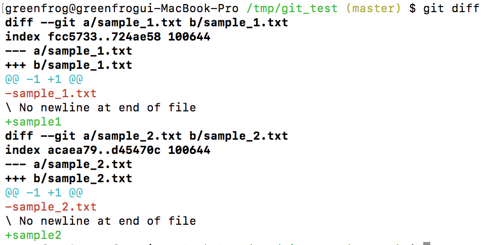
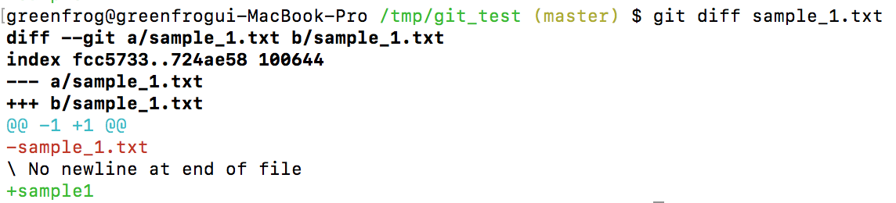
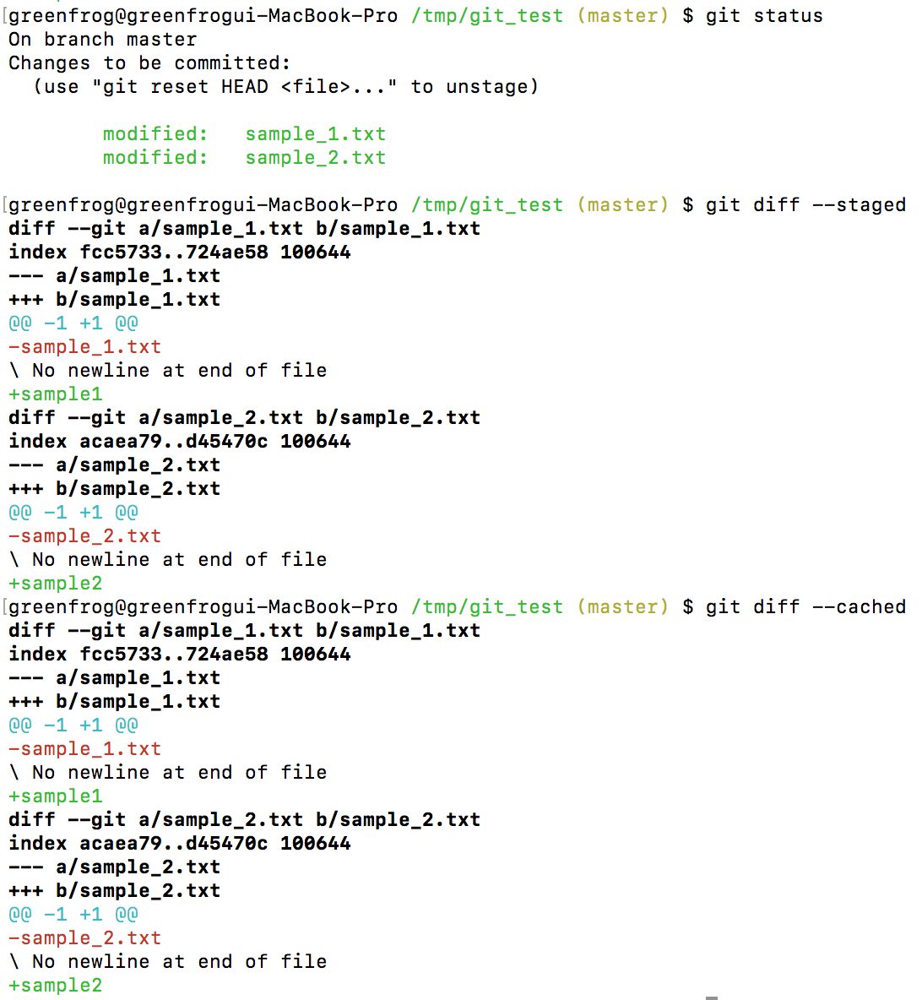
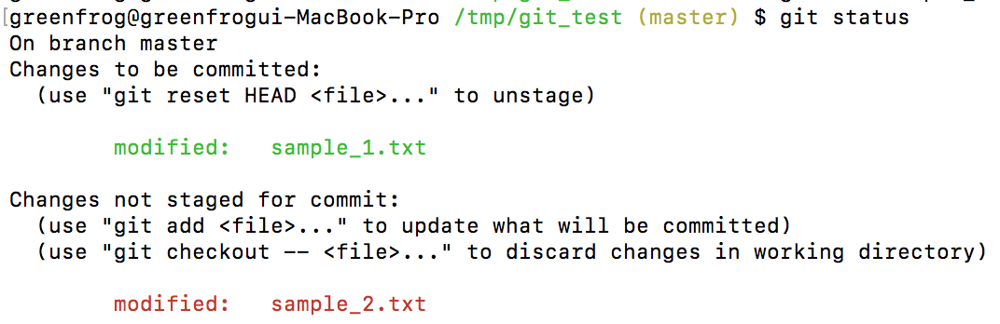
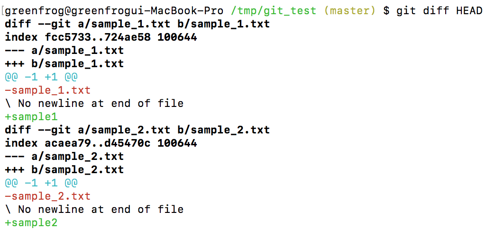
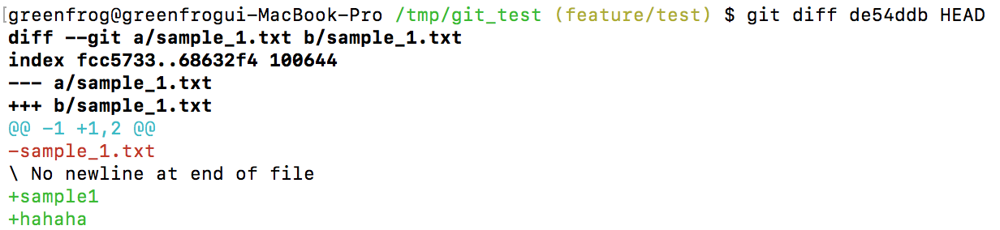
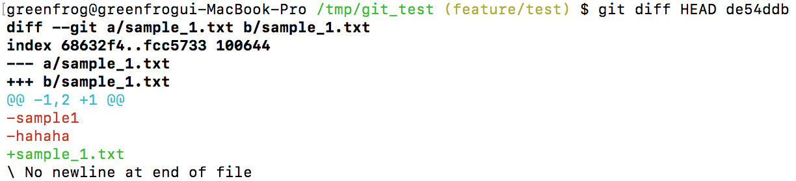

# 저장소의 데이터와 변경 된 데이터를 비교하는 방법

## 개요

git은 저장소의 데이터와 작업 디렉토리 또는 스테이징 된 데이터의 차이점을 비교할 수 있다.

다음과 같이 sample 파일을 두개 만들어서 실습하도록 한다.

sample_1.txt
```
sample_1
```

sample_2.txt
```
sample_2
```

## 작업 디렉토리와 저장소간 비교

데이터를 수정하고 'git add <file name>'명령을 사용하지 않으면 변경된 데이터는 작업 디렉토리에 존재하게 되는데, 작업 디렉토리에 있는 변경사항과 저장소의 데이터를 비교하는 명령은 다음과 같다.

```bash
$ git diff <file name>(optional)
```

git diff 뒤에 파일명을 따로 주지 않으면, 작업 디렉토리에 존재하는 모든 변경사항을 저장소와 비교하고 파일명을 주면 해당 파일에 대해서 작업 디렉토리의 변경사항과 저장소의 데이터를 비교한다.

다음과 같이 sample_1.txt와 sample_2.txt파일의 데이터를 각각 수정하자.

sample_1 -> sample1
sample_2 -> sample2

방금 수정한 내용은 작업디렉토리에 존재하게 된다. 따라서 작업 디렉토리의 모든 변경 사항을 확인하는 다음 명령을 수행해보자.

```bash
$ git diff
```

위 명령의 결과는 다음과 같다. 빨간색으로 변경 전의 내용이 출력되고 초록색으로 변경 후의 내용이 출력된다.



이번에는 sample_1.txt파일의 변경 사항만을 확인해 보자.

```bash
$ git diff sample_1.txt
```

결과는 다음과 같다. sample_1.txt파일에 대한 변경 사항만 출력된다.



## 스테이징 된 변경사항과 저장소간 비교

스테이징 상태의 변경사항과 저장소간 비교를 위해서는 다음 명령을 사용한다.

```bash
$ git diff --staged or --cached <file name>(optional)
```

위 명령을 사용해서 스테이징 상태의 모든 변경사항 대해서 저장소간 차이점을 비교해보자.

--staged 옵션을 사용하던, --cached 옵션을 사용하던 결과는 동일하다.



--staged 옵션 또는 --cached 옵션 뒤에 특정 파일명을 주면 해당 파일에 대한 변경사항과 저장소간의 차이점을 비교한다.
앞서 설명한 git diff <file name>의 사용방법과 동일하므로 따로 설명하지 않는다.

## 모든 변경사항 비교

작업 디렉토리에 있는 변경사항 및 스테이징 된 변경사항 모두를 저장소와 비교하고자 한다면 다음 명령을 사용한다.

```bash
$ git diff HEAD
```

다시 sample_1.txt와 sample_2.txt를 복원한 후 다시 수정해서 sample_1.txt는 스테이징 시키고 sample_2.txt는 작업 디렉토리에 유지하자.

다음은 git status 명령으로 각각의 파일의 상태를 확인한 모습이다. sample_1.txt는 스테이징 되었고, sample_2.txt는 작업 디렉토리에 존재한다.



이 상태에서 다음 명령을 실행해보자.

```bash
$ git diff HEAD
```

결과는 다음과 같이 스테이징 된 sample_1.txt와 작업 디렉토리에 존재하는 sample_2.txt 모두 비교된 것을 확인할 수 있다.



## 다른 커밋들의 변경사항 비교하기

이미 여러 커밋들이 존재한다면 커밋들 간의 변경 사항 역시 비교해볼 수 있다.
커밋로그들 간의 변경사항을 비교하는 명령은 다음과 같다.

```bash
$ git diff <source commit number> <target commit number>
```

<source commit number>는 비교의 기준이 되는 commit number이고 <target commit number>는 비교의 대상이 되는 commit number이다.

다음과 같은 커밋로그가 있다.


이때, initial commit(de54ddb)을 기준으로 HEAD(c2f618f)가 얼마나 수정이 되었는지 확인해보자.

```bash
$ git diff de54ddb HEAD
```

결과를 보면 initial commit(de54ddb)를 기존으로 HEAD(c2f618f)의 변경사항이 출력되고 있다.



위 명령을 반대로 사용하여 <source commit number>와 <target commit number>가 바뀌는 결과 역시 거꾸로 나타난다. 다음 결과를 참고하자.



그러면, 다른 커밋들 중에서 특정 파일을 비교하는 명령은 다음과 같다.

```bash
$ git diff <source commit number> <target commit number> <target file name>
```

파라메터들은 <source commit number> <target commit number>까지는 기존과 동일하다. 다른 것은 <target file name>이 추가된 것인데, 앞선 예제에서 sample_1.txt 파일을 명시적으로 비교해보자.

```bash
$ git diff de54ddb HEAD sample_1.txt
```

결과는 다음과 같다.


## 참조

* [Git, 분산버전 관리 시스템 - 차이점 살펴보기](https://mylko72.gitbooks.io/git/content/commit/diff.html)
* [How to diff the same file between two different commits on the same branch?](https://stackoverflow.com/questions/3338126/how-to-diff-the-same-file-between-two-different-commits-on-the-same-branch)
