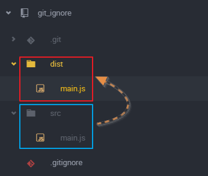
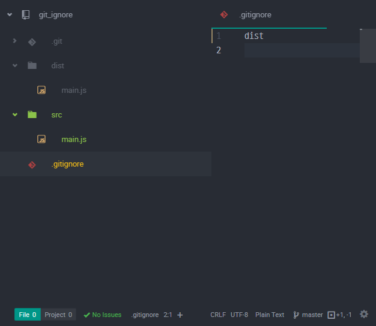
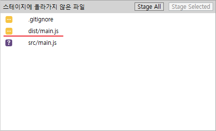
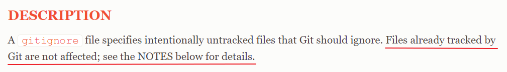
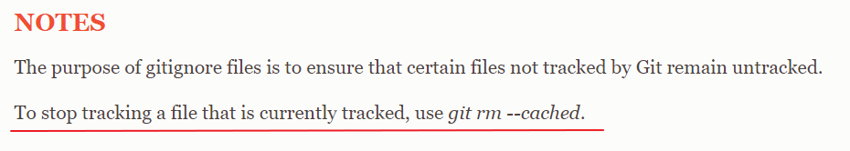
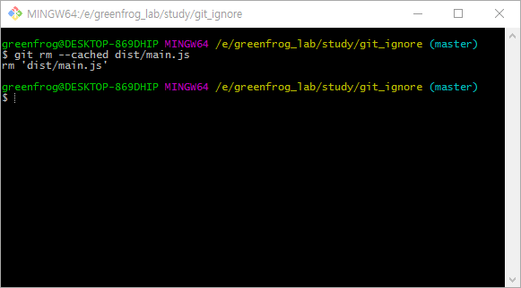
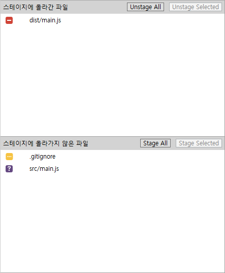
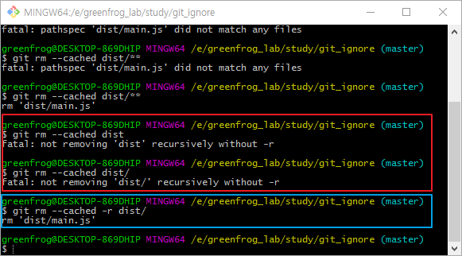

# 이미 추적 중인 파일 또는 폴더 추적되지 않도록 하기

다음과 같은 폴더구조가 있다고 가정하자.

* src : 소스 경로
* dist : 소스 경로에서 빌드 된 파일이 저장되는 경로

이 같은 경우 **dist**는 **src**를 빌드한 파일들이 저장되는 경로이므로 git에 커밋할 필요가 없다. 따라서, **.gitIgnore**파일에 **dist**경로를 추가해보자.

그리고 빌드를 한 후 SourceTree를 통해서 변경 된 파일 목록을 보면 ... 여전히 ignore 시킨 **dist** 폴더의 파일이 변경된 파일로 나타난다 ..

이유를 확인하기 위해 git 홈페이지의 [gitIgnore](https://git-scm.com/docs/gitignore)관련 문서를 확인해봤다. 여기보면 **DESCRIPTION**문단의 두번째 문장에 다음과 같은 내용이 명시되어있다.

그래서 해당 문서의 마지막에 있는 **NOTE**를 확인해보면 .. 두번째 문장에 해결방법이 명시되어있다.

SourceTree에서 git터미널 창을 열고 다음과 같이 작성해보자. 형식은 다음과 같다.

>git rm --cached [추적을 그만하고자 하는 파일명]

다시 SourceTree로 돌아와서 스테이지 상태를 F5를 통해 갱신해보면 다음과 같이 나온다.

이 상태로 커밋을 하고 src를 다시 빌드해보자. 이제 더 이상 dist 경로는 추적되지 않는다.

만약, 이미 추적되고 있는 dist경로의 파일이 여러개면 어떻게 해야할까? 다음과 같은 옵션을 사용하면된다.

>git rm --cached -r [추적을 중지하고자 하는 폴더명]

아래 그림의 빨간 박스는 -r옵션을 제외해서 발생한 에러 메세지이고 파란 박스가 -r옵션을 올바르게 적용한 모습이다.

