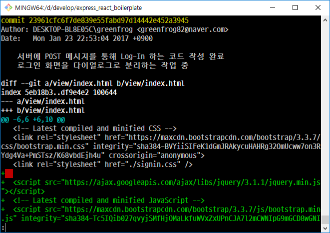
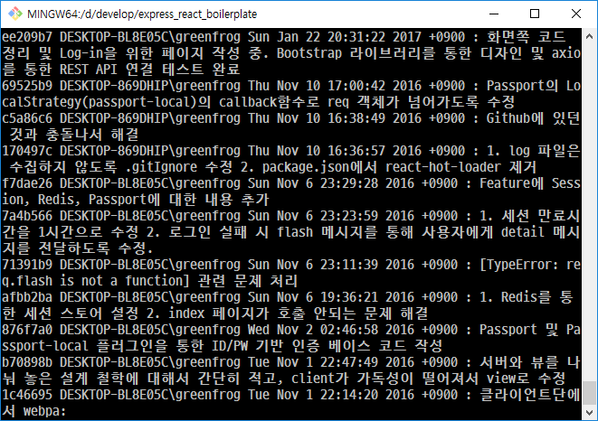
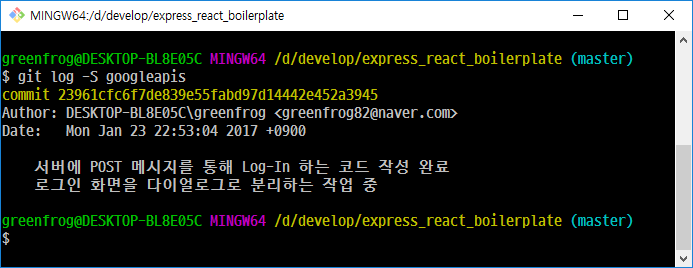
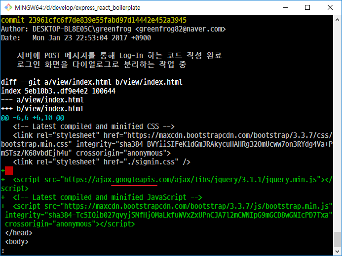

# git log에 대해서 

## git log 명령

### git log

커밋로그를 최신순으로 조회한다.

```
$ git log
```

### git log -p -n

최신순으로 n개의 커밋을 보여주며, 각 커밋간의 차이점을 diff로 보여준다.

```
$ git log -p -2
```



### git log --stat

각각의 커밋에 대해서 어떤 파일이 얼마나 변경되었는지 보여준다. 

```
$ git log --stat
```


위 그림에서 파일명 옆에 숫자는 수정된 라인수를 이야기하고, +는 추가 된 라인, -는 삭제된 라인을 가리킨다. 

### git log --pretty=format:

자신만의 형식으로 커밋로그를 조회한다. 

```
$ git log --pretty=format:'%h %an %ad : %s'
```



자세한 내용은 다음 링크를 확인하자.

[git PRETTY FORMATS](https://git-scm.com/docs/pretty-formats)

### git log --graph --oneline --decorate

[SourceTree](https://www.sourcetreeapp.com/)와 흡사하게 커밋로그를 출력한다. 

```
$ git log --graph --oneline --decorate
```


다음과 같이 --oneline을 pretty=oneline으로 사용할 수도 있다.

```
$git log --graph --decorate --pretty=oneline
```


이 둘의 차이점은 커밋 해쉬값이 full name, short name으로 출력하느냐이다. 

* full name : --pretty=oneline
* short name : --oneline

## 조회하기

### git log -S '문자열'

코드에서 추가되거나 제거된 내용 중에 특정 텍스트가 포함되어 있는지를 검색한다.

```
$ git log -S googleapis
```



위 결과를 확인하기 위해 해당 커밋의 diff를 보면 다음과 같다. 



## 주의 

위에 설명한 모든 명령에서 git log 다음에 origin 또는 upstream등과 같이 remote repository의 이름을 넣으면 remote repository에 대한 커밋로그를 보여준다.

## 참조

[How can I show the name of branch in 'git log'](http://stackoverflow.com/questions/1841405/how-can-i-show-the-name-of-branches-in-git-log)
[git-log -Show commit logs](https://git-scm.com/docs/git-log)
[커밋 히스토리 조회](https://mylko72.gitbooks.io/git/content/history.html)
