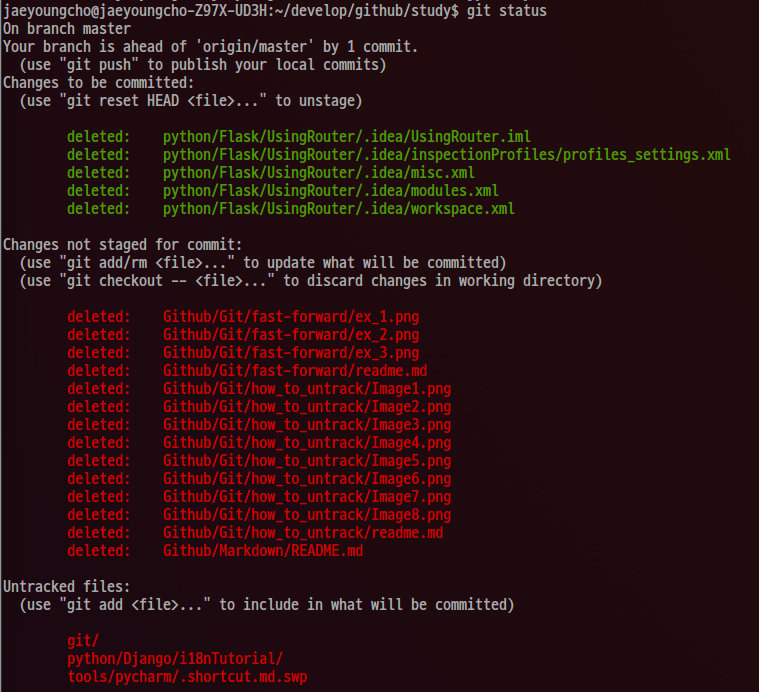

# status 명령

다음 명령을 통해서 현재 local repository의 상태(Unstatged Files, Statged Files, Untracked Files, so on ..)를 확인할 수 있다.

> git status 

예를들어, 위 명령을 날리면 다음과 같이 현재 local repository의 상태가 출력된다.

# 참조

* [Git, 분산버전시스템](https://www.gitbook.com/book/mylko72/git/details)
