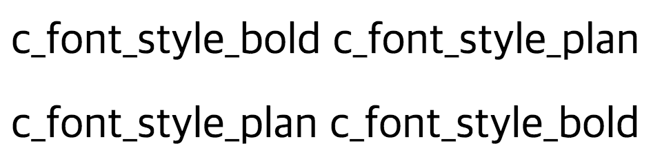

# HTML class attribute with white space

CSS 적용할 때, 다음과 같이 HTML의 class 속성에 값을 띄어쓰기로 연속해서 작성하는 경우가 있다.

```html
<h1 class='a b'>...</h1>
```

이와 같이 여러개의 class값을 사용하면 어떤식으로 동작하게 될까? 결론부터 이야기하면 각각의 CSS가 적용되게 된다.

예를들어, 다음과 같은 CSS가 정의되어 있다고 가정하자.

```html
<style>
.c_font_style_bold { font-weight: bold; }
.c_font_color { color: red; }
</style>
```

위 CSS를 다음과 같이 적용해보자.

```html
<h1 class='c_font_style_bold c_font_color'>c_font_style_bold c_font_color</h1>
```

결과는 다음이 bold 속성과 red 속성이 적용된 문자가 출력된다.


위 예제는 두 개의 class만 적용하였지만 n개의 class의 적용할 수 있다.

class를 적용할 때 주의해야할 것이 있는데, 다음과 같이 동일한 속성에 다른 값이 적용된 CSS가 정의 된 경우다.

```html
<style>
.c_font_style_plan { font-weight: normal; }
.c_font_style_bold { font-weight: bold; }
</style>
```

위와 같은 경우, 다음과 같이 사용했다면 결과가 어떻게 나올까?

```html
<h1 class='c_font_style_bold c_font_style_plan'>c_font_style_bold c_font_style_plan</h1>
```

위 결과는 다음과 같이 normal속성이 bold로 override 되었음을 알 수 있다.


그러면 다음과 같이 class 값을의 위치를 바꿔보면 어떻게 될까?

```html
<h1 class='c_font_style_plan c_font_style_bold'>c_font_style_plan c_font_style_bold</h1>
```

이 경우 역시 앞선 결과와 동일하게 normal속성이 bold로 override 되었음을 알 수 있다.  


이와 같이 특정 속성이 다른 속성으로 override되는 것은 <style></style> 태그 사이에 CSS를 정의하는 순서에 의존되는데, 앞서 정의한 CSS의 순서를 다음과 같이 수정하고 위 예제들을 실행시켜보면 bold속성이 normal로 override 되는 것을 알 수 있다.

```html
<style>
.c_font_style_bold { font-weight: bold; }
.c_font_style_plan { font-weight: normal; }
</style>
```



## 참조

* [HTML class attribute with spaces, it is a W3C valid class? [closed]](http://stackoverflow.com/questions/13808846/html-class-attribute-with-spaces-it-is-a-w3c-valid-class)
