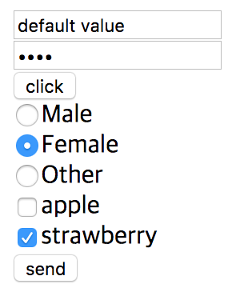
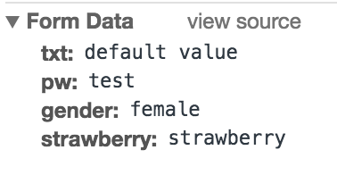

# input tag의 value attribute에 대해서

value attribute의 경우 <input> tag의 값을 명시하는데, 이 값은 <input> tag의 타입에 따라 다르게 사용된다.
다음은 <input> tag의 타입에 따라 value attribute의 용도이다.

* button, reset, submit - button의 text를 정의한다.
* text, password, hidden - input 필드의 기본값을 정의한다. 정의 된 값은 submit시 서버로 전달된다.
* checkbox, radio, image - input에 할당되는 값을 정의한다. 정의 된 값은 submit시 서버로 전달된다.

**주의** : <input type='file'>에는 value attribute를 사용할 수 없다.

```html
<!DOCTYPE html>
<html lang='en'>
<head>
 <meta charset='UTF-8'>
 <title>Example</title>
</head>
<body>
  <form method='post'>
    <input type='text' name='txt' value='default value'/><br />
    <input type='password' name='pw' value='test' /><br />
    <input type='button' value='click' /><br />
    <input type='radio' name='gender' value='male'>Male<br />
    <input type='radio' name='gender' value='female' checked>Female<br />
    <input type='radio' name='gender' value='other'>Other<br />
    <input type='checkbox' name='apple' value='apple' />apple<br />
    <input type='checkbox' name='strawberry' value='strawberry' checked/>strawberry<br />
    <input type='submit' value='send'/>
  </form>
</body>
</html>
```

#### 출력 결과



출력 결과는 앞선 설명과 동일함을 확인 할 수 있다. 'submit' 버튼을 누르면 다음과 같이 text, password, radio, checkbox 타입의 value attribute의 값이 서버로 전달 됨을 알 수 있으며, radio와 checkbox의 경우 선택 된 것만 서버로 전달되는 것을 알 수 있다.



## name attribute

앞선 예제에서 name attribute가 사용되었는데, 이는 input tag에 이름을 명시하는 것으로 JavaScript에서 input tag를 구분하거나, submit 되었을 때 어떤 input tag에 대한 값이 전달되었는지 구분하기 위해서 사용된다.

쉽게 생각하기 위해서는 name attribute는 변수명이고 value attribute는 값이라고 생각하면 된다.

## 참조

* [HTML <input> value Attribute](https://www.w3schools.com/tags/att_input_value.asp)
* [HTML <input> name Attribute](https://www.w3schools.com/tags/att_input_name.asp)
