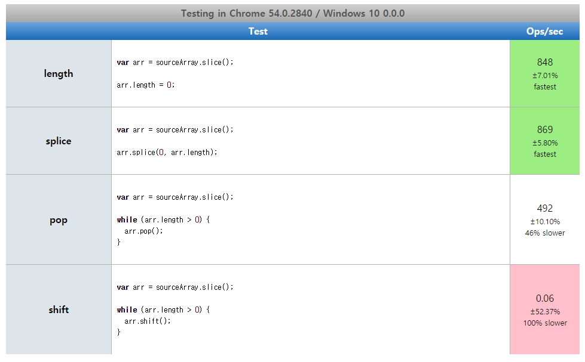

# 배열의 모든 요소 삭제하기

배열 numbers가 있다고 하자.

```javascript
var numbers = [1, 2, 3];
```

배열 numbers의 요소를 모두 삭제하고 빈 배열을 만들려면 어떻게 해야할까? 의식을 하지 않고 코딩을 한다면 자바스크립트에는 배열의 요소를 한번에 비우는 메소드가 명시적으로 존재하지 않으므로 다음과 같이 코딩을 할 수 있다.

```javascript
// 방법 1.
numbers = [];
```

위 코드는 아주 정확하게 동작한다. 하지만, 메모리 관점에서 보면 원래 numbers에 할당되어 있던 [1, 2, 3]은 메모리 어딘가에 참조하는 변수를 잃은채 존재하고 있을 것이다. (물론, 가비지 컬렉터에 의해 수집되겠지만 ...) 그리고 numbers에는 새로운 배열 객체가 생성되어 할당될 것이다.

그러면, 새로운 배열 객체를 할당하는 방법 말고 이미 할당 된 배열을 유지한채 배열의 모든 요소를 삭제하는 방법은 무엇일까?

몇 가지 방법이 있는데 그 중 하나는 배열의 사이즈만큼 반복문을 돌리면서 pop() 메소드 또는 shift() 메소드를 통해 요소를 하나씩 제거하는 방법이다.

```javascript
// 방법 2.
while(numbers.length) {
  numbers.pop();
}
// or
while(numbers.length) {
  numbers.shift();
}
```
하지만, 이 방법은 언뜻봐도 배열의 요소를 하나하나 순회하면서 제거하기 때문에 성능상 매우 안 좋아보이며, 코드도 간경하지 못하다.

또 다른 방법은 다음과 같다.

```javascript
// 방법 3.
numbers.length = 0;
```

이 방법은 정상적으로 동작하지 않을 것 같지만, 아주 잘 동작하며 성능도 아주 우수하다. 하지만 자바스크립트 엔진이 ES6를 준수할 때만 사용가능하다고 한다.

마지막 방법은 다음과 같다.

```javascript
// 방법 4.
numbers.splice(0, numbers.length);
```

이 방법 역시 아주 잘 동작하며, 방법 3과 같이 아주 간결하고 성능도 좋다. 방법 3과 다른 점은 ES6를 준수하지 않아도 된다는 것이다.

이 방법들의 성능을 비교해보면 다음과 같다.

```javascript
var sourceArray = [];

for (i=0;i<100000;i++) {
  sourceArray.push({a: 1, b: "2"});
}
```



위 내용에는 '방법1'에 대한 성능이 나와있지 않아서 그냥 고전적인 방법으로 4가지 방법을 모두 측정해봤다.

```javascript
var numbers = [];

for(var i=0; i<10000000; i++) {
  numbers.push({a:i, b:i+1, c:i*1});
}

var start = new Date();
numbers = [];
// numbers.length = 0;
//numbers.splice(0, numbers.legnth);
// while(numbers.length) {
//   numbers.pop();
// }
var stop = new Date();
console.log('Elapse : ', stop - start);
```

결과는 상당히 큰 배열 사이즈를 비워봤는데도 방법1, 3, 4는 거의 비슷한 성능을 냈다. 사실, 그냥 새로운 배열을 생성해서 할당하는 방법1이 앞도적으로 빠를줄 알았지만 그렇지 않았다.

## 결론

성능에 별 차이가 없었으므로 새로 메모리 공간을 할당하고 가비지 컬렉션의 대상을 하나 더 만들기보다는 방법 3 또는 방법 4를 통해서 배열의 요소를 모두 비우는 것이 좀 더 좋은 방법이 아닐까한다.

```javascript
// 방법 3.
numbers.length = 0;
```
```javascript
// 방법 4.
numbers.splice(0, numbers.length);
```

## 참조

* [How do I empty an array in JavaScript](http://stackoverflow.com/questions/1232040/how-do-i-empty-an-array-in-javascript)
