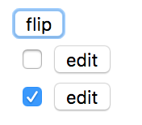

# jQuery를 통해 HTML5의 Custom Data Attributes 이용하기

HTML5의 Custom Data Attributes를 이용하면 HTML에 특정 데이터 쓰고나 읽을 수 있다.

예를들어, 각각 HTML Tag가 상태값을 가지고 있어야하는 경우에 Custom Data Attribute를 사용하면 좀 더 간단하고 가독성 있는 코드를 작성할 수 있다.

다음과같은 시나리오를 생각해보자. Table의 각각의 행에는 checkbox와 button이 있다. 'flip' 버튼을 누르는 경우 checkbox의 button은 hide 시키고 'flip'버튼을 다시 누르면 hide 됐던 버튼을 다시 show 시킨다고하자. 이런 경우 css의 display: none 속성을 확인하는 방법도 있겠지만 Custom Data Attributes를 활용하면 좀 더 간단하고 가독성 있는 코드를 작성할 수 있다.



다음은 앞선 시나리오를 Custom Data Attribute와 jQuery의 data method를 통해 구현한 코드이다.

```html
<!doctype html>
<html lang="en">
<head>
<meta charset="utf-8">
<meta name="viewport" content="width=device-width, initial-scale=1">
<title>Data</title>
<script
  src="https://code.jquery.com/jquery-3.2.1.min.js"
  integrity="sha256-hwg4gsxgFZhOsEEamdOYGBf13FyQuiTwlAQgxVSNgt4="
  crossorigin="anonymous"></script>
<script
  src="https://code.jquery.com/ui/1.12.1/jquery-ui.min.js"
  integrity="sha256-VazP97ZCwtekAsvgPBSUwPFKdrwD3unUfSGVYrahUqU="
  crossorigin="anonymous"></script>
</script>
<script>
  $(document).ready(function() {
      $('#btn_flip').click(function() {
        $('#test_table tr').each(function() {
            if(!$(this).find(':checkbox:checked').length) {
              console.log('unchecked');
              return;
            }

            var user_info = $(this).find('input[type="button"][value="edit"]');
            console.log(user_info);
            var is_visible = user_info.data('visible');

            console.log(is_visible);
            console.log(typeof is_visible);

            if(is_visible) {
              $(this).find("input[type='button'][value='edit']").hide();
              user_info.data('visible', false);
            } else {
              $(this).find("input[type='button'][value='edit']").show()
              user_info.data('visible', true);
            }
        });
      });
    });
</script>
</head>
<body>
  <input type='button' id='btn_flip' value='flip'/><br />
  <table id='test_table'>
    <tr>
      <td>
        <input type='checkbox' />
      </td>
      <td>
        <input type='button' id='btn_1' value='edit' data-visible='true' />
      </td>
    </tr>
    <tr>
      <td>
        <input type='checkbox' checked />
      </td>
      <td>
        <input type='button' id='btn_2' value='edit' data-visible='true' />
      </td>
    </tr>
  </table>
</body>
</html>
```

Custom Data Attributes를 정의하는 방법은 HTML tag에 다음과 같은 형식으로 attribute와 값을 정의하면 된다.

```html
<tag data-<variable_name>='<value>'>
```

위 코드를 보면 button에 'data-visible'라는 Custom Data Attribute를 정의해 주고 각각 'true'값을 주었다. 다음과 같다.

```html
<input type='button' id='btn_1' value='edit' data-visible='true' />
<input type='button' id='btn_2' value='edit' data-visible='true' />
```

이제 'flip'버튼을 클릭할 때, 버튼의 상태값을 읽어서 data-visible이 true이면 false로 바꾸고 버튼을 hide 시켜야하고 반대의 경우에는 true로 바꾸고 버튼을 show 시켜야하는데 어떻게 data-visible의 값을 읽어야할까? 또한 Custom Data Attributes는 HTML5의 feature인데 브라우저가 HTML5를 지원하지 않는 경우에는?

jQuery의 data method를 사용하면 Custom Data Attributes를 쉽게 읽고 쓸수 있으며 HTML5를 지원하지 않는 환경에서도 아주 잘 동작한다.

다음은 jQuery data method의 내용 중 일부를 발췌한 내용인데 jQuery 1.4.3버전부터 HTML5의 Custom Data Attributes의 데이터를 자동으로 읽어들여서 jQuery의 data object로 관리한다고 되며, 1.6버전에서는 W3C의 HTML5 명세를 준수하도록 변경되었다고 나와있다.

```
HTML5 data-* Attributes

As of jQuery 1.4.3 HTML 5 data- attributes will be automatically pulled in to jQuery's data object. The treatment of attributes with embedded dashes was changed in jQuery 1.6 to conform to the W3C HTML5 specification.
````

jQuery의 data method를 통해서 데이터를 읽고 쓰는 방법은 다음과 같다.

**Reading**
```javascript
.data(key)
```

**Writing**
```javascript
.data(key, value)
```

data method에서 key는 Custom Data Attributes의 data- prefix를 제외한 부분을 이야기하며 value는 실제 JavaScript의 데이터타입에 해당하는 값을 이야기한다.

예를들어, 위 예제에서 data-visible이라는 Custom Data Attributes를 정의하고 값으로 'true'를 주었는데 이를 읽기 위해서는 다음과 같이해야한다.

```javascript
.data('visible');
```
여기서 특이점은 .data함수를 통해 읽기를 하면 'true'라는 문자열을 반환하는 것이 아니라 Boolean형을 반환한다는 것이다.
.data함수는 해당 변수에 할당 된 값을 유추해서 JavaScript의 데이터형으로 변환한 값을 반환한다.

읽기를 했으니 이제 data-visible이라는 Custom Data Attributes에 false라는 값을 써보자. 다음과 같이하면 된다.

```javascript

읽기를 했으니 이제 data-visible이라는 Custom Data Attributes에 false라는 값을 써보자. 다음과 같이하면 된다.

```javascript
.data('visible', false);
```

쓰기를 할 때 역시 'false'라는 문자열을 넘길 필요없이 JavaScript의 데이터형을 넘기면 된다.

## 참조

* [jQuery: data() 이해와 활용](http://www.nextree.co.kr/p10155/)
* [HTML5의 Custom Data Attributes를 이용하여 HTML을 의미있는 데이터로 사용하기](http://blog.saltfactory.net/using-html5-custom-data-attributes/)
* [.data()](https://api.jquery.com/data/)
