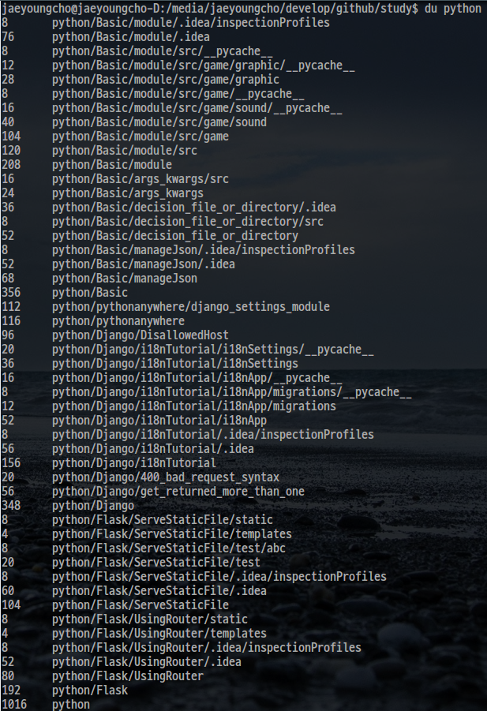
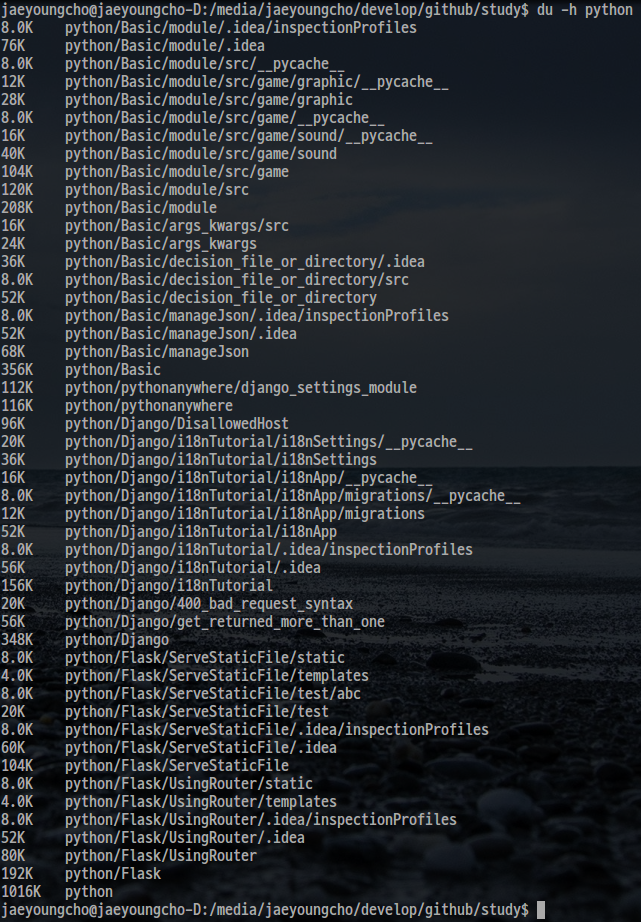
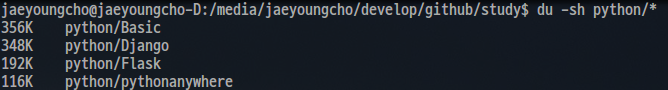

# 디렉토리 용량 확인하기

## 개요

du는 dist usage의 약자로 shell 상에서 특정 디렉토리의 용량을 표시해주는 유틸리티이다. du를 사용하는 방법에 대해서 알아보자.

## 디렉토리와 해당 디렉토리의 모든 하위 디렉토리 용량 표시하기

```
$ du <directory name>
```

파이썬을 공부하는데 사용하고 있는 디렉토리의 용량을 표시해보았다. 

```
$ du python
```



결과를 보면 python과 모든 하위 디렉토리가 표시되고 각각 디렉토리의 용량이 표시됨을 알 수 있다. 
여기서 주의할 것은 모든 디렉토리에 표시된 용량은 자신의 하위 디렉토리의 용량을 합한 것이라는 것이다. 예를들어, 결과 맨 아래에 python 디렉토리에 대한 용량을 표시되어 있는데 python은 검사한 디렉토리의 최상위 디렉토리이므로 모든 하위 디렉토리의 용량을 합산한 용량이 표시되고 있는 것이다. 

또한 du명령은 디렉토리의 용량을 표시해주는 유틸리티이므로 파일은 표시되지 않는다. 

위 결과를 보면 한가지 아쉬운 점이 해당 디렉토리의 용량을 인식하기가 불편하다는 것이다. 이는 du가 기본적으로 kbyte 단위로 용량을 표시하기 때문인데 이를 가독성 있게 표시하기 위해서는 -h 옵션을 사용한다. 

-h옵션을 사용해서 위 결과를 다시 출력해보자.

```
$ du -h python
```



결과를 보면 용량을 표시하는 부분에 단위가 함께 표시되고 있는 것을 확인할 수 있다.

## 하위 디렉토리를 표시하지 않고 해당

앞서 용량을 검사하고자 하는 디렉토리의 모든 하위디렉토리까지 모두 표시를 하였는데, 만약 특정 디렉토리만 표시하고 싶은 경우 -s 옵션을 사용한다. 

```
$ du -s <directory name>
```

위 명령을 통해서 python디렉토리의 용량만을 표시해보자. 

```
$ du -sh python
```

결과를 좀 더 가독성 있게 보기 위해서 -h 옵션을 함께 사용하였다. 결과는 다음과 같다. 


## 디렉토리와 해당 디렉토리의 첫번째 하위 디렉토리 용량 표시하기

특정 디렉토리를 출력하고 해당 디렉토리의 첫번째 하위 디렉토리까지만 용량을 표시하고 싶다면 다음과 같이 경로 다음에 /*을 사용한다.

```
$ du <directory name>/*
```

파이썬 디렉토리의 첫번째 하위 디렉토리까지만 용량을 표시해보자. 

```
$ du python/*
```

결과는 다음과 같다. 




## 참조

* [리눅스 폴더(디렉토리) 용량 확인하는 명령어 - du](https://www.cmsfactory.net/node/11155)
