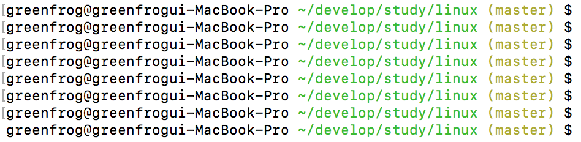

# git의 브랜치명을 command line prompt에 표시하기

## 개요

git의 브랜치명을 확인하는 명령을 사용하면 현재 자신이 어떤 브랜치를 사용하고 있는지 쉽게 확인할 수 있다. 하지만, 이렇게 하면 매번 자신이 어떤 브랜치를 쓰고 있는지 명령을 통해 확인해야한다. 
따라서, 현재 자신이 사용하고 있는 브랜치명이 command line prompt에 표시되면 편리한데 이를 표시하는 방법에 대해서 알아보자. 

우선, command line prompt를 설정하기 위해서는 PS1이라는 변수를 수정해야한다. PS1은 'Prompt String 1'의 약자로 이 변수에 설정된 내용이 command line prompt에 나타나게 된다. 

## Mac

.bash_profile 파일을 열어서 다음 내용을 입력한다. 

```bash

rse_git_branch() {
     git branch 2> /dev/null | sed -e '/^[^*]/d' -e 's/* \(.*\)/ (\1)/'
}
export PS1="\u@\h \[\033[32m\]\w\[\033[33m\]\$(parse_git_branch)\[\033[00m\] $ "
```

다음은 위 내용이 적용된 모습니다. 




## Ubuntu


## 참조

* [Add git  branch name to bash prompt](https://coderwall.com/p/fasnya/add-git-branch-name-to-bash-prompt)
* [Git tip: Show your branch name on the Linux prompt](https://www.leaseweb.com/labs/2013/08/git-tip-show-your-branch-name-on-the-linux-prompt/)
