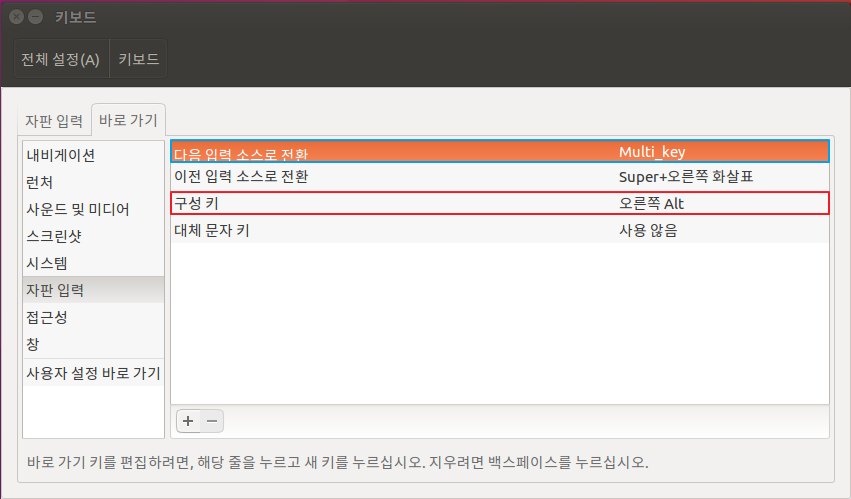

# 한글 설정 및 한글 키 사용하기

Ubuntu 14.04.5 LTS
Ubuntu 16.04.1 LTS

## 한글 설정하기

다음 순서를 따라 한글을 설정한다. 

### 시스템 설정 -> 언어지원를 선택

언어지원 대화상자가 출력되면 '키보드 입력기'를 IBus로 설정한다. 

### 시스템 설정 -> 텍스트 입력 창 선택

다음과 같이 '+' 버튼을 클릭한 후 '한국어(Hangul)(IBus)'를 선택한다. 반드시 '한국어(Hangul)(IBus)'를 선택해야한다.

그리고, '다음 소스로 전환:'의 입력 컨트롤을 마우스로 선택한 후 '한글' 키를 입력하면 끝.

## 트러블 슈팅

위와 같이 설정하면, 데스크톱에서는 '한글' 키를 통한 한글입력이 잘 처리된다. 하지만, 우분투를 VirtualBox에 설치했거나 노트북에 설치했다면 '한글' 키를 눌렀을 때 다음 그림과 같이 '런처 허드'가 실행되는 것을 볼 수 있다. 

이는 Alt-L과 Alt-R 모두가 리눅스의 특수키 맵핑 정보에 mod1으로 설정되어 있기 때문이다. 이는 터미널에서 '$ xmodamp' 명령을 통해서 확인 할 수 있다. 

이를 해결하기 위해서는 다음 절차를 따른다. 

### 시스템 설정 -> 텍스트 입력 창 선택

우하단의 '키보드 설정 ...' 링크를 선택한다. 

그러면 다음과 같이 '키보드 설정' 대화상자가 출력된다. 여기서 주목할 점은 '다음 입력 소스 전환'이 'Alt R'로 되어있고, '구성 키'가 '사용하지 않음'으로 되어있는 것이다. 

이를 각각 다음과 같이 수정하자. 반드시 순서를 따르도록 한다. 

1. '구성 키'를 '오른쪽 Alt'로 수정한다.
2. '다음 입력 소스 전환'에 '한글'키를 입력한다. 

위 수정이 끝나면 다음과 같은 화면이 설정되어 있어야한다. 특이한것은 '다음 입력 소스 전환'에 '한글'키를 입력했지만, 'Multi_key'로 설정되었다는 것이다.

여기까지 따라왔다면 '한글'키를 통한 한글 설정이 모두 끝났다. 

## 참조

* [Ubuntu 14.04 LTS 내게 맞게 설정하기](http://blog.daum.net/bagjunggyu/154)