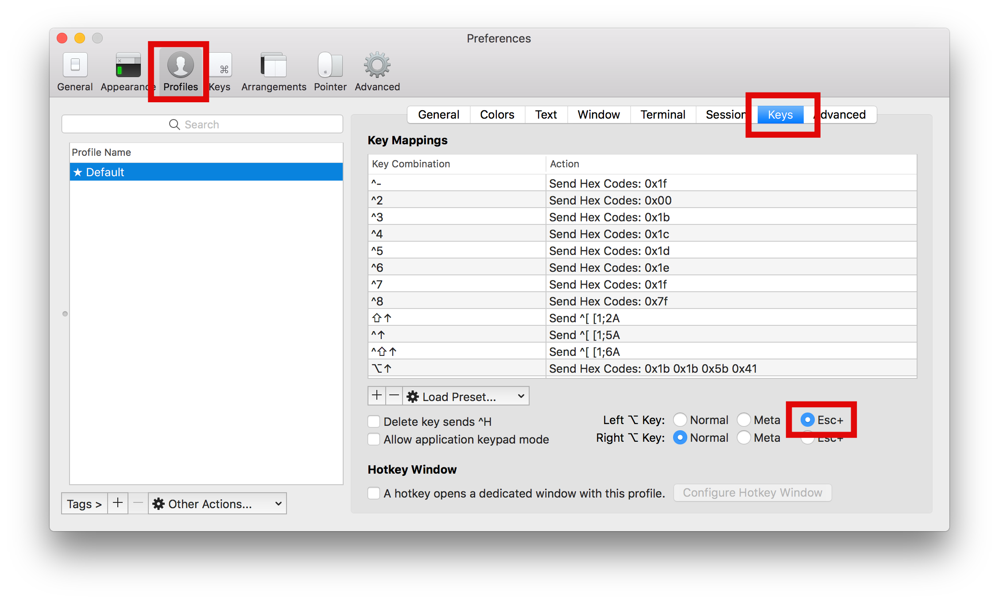

# iTerm2

우분투 리눅스를 사용하면서 터미널을 굉장히 많이 활용하고 있다. 그 중에서도 split 기능을 많이 활용하고 있는데 기본 터미널에서는 split 기능이 없기 때문에 [Terminator](https://gnometerminator.blogspot.kr/p/introduction.html)라는 프로그램을 쓰고 있다.

Mac을 사용하면서 역시 터미널을 많이 활용하고 있는데, 기본 터미널의 경우 vertical split 기능을 제공하지 않아서 굉장히 불편했다. 따라서 [Terminator](https://gnometerminator.blogspot.kr/p/introduction.html)와 같은 프로그램을 찾아보았는데 [iTerm2](https://www.iterm2.com/)를 찾았다.
본 문서에서는 이를 활용하는 방법을 정리하였다.

## ShortCut

### Split

* Vertical Split : cmd + d
* Horizontal Split : cmd + shift + d
* Navigate : cmd + option + arrow

### Movement

* ctrl + e : 명령라인의 마지막으로 이동
* ctrl + a : 명령라인의 처음으로 이동
* alt + d : 커서 뒤쪽 단어 삭제
* alt + f : 한 단어 앞으로 이동
* alt + b : 한 단어 뒤로 이동

### etc

* ctrl + l : clear
* ctrl + u : 커서 왼쪽 문자들 지우고 버퍼에 저장
* ctrl + k : 커서 오른쪽 문자들 지우고 버퍼에 저장
* ctrl + y : 삭제하고 버퍼에 저장했던 문자열 붙이기

## Toubleshooting

### alt key activation

iTerm2를 사용하면 기본적으로 alt키가 비활성화 되어있다. 따라서, alt + d, f, b 등과 같은 단축키를 사용하기 위해서 alt키를 활성화 시켜주어야한다. 

설정화면(Cmd + ,)을 연 후 profile -> keys 순으로 이동한 후 Left option key를 Esc+로 선택한다. 다음 이미지 참조

## Reference

* [iTerm2 - Documentation](https://www.iterm2.com/documentation-one-page.html)
* [자주 사용할 만한 bash 터미널 단축키(+맥 사용자 ƒ∫ 문제 해결법)](https://mytory.net/archives/10287)
* [iTerm 2: How to set keyboard shortcuts to jump to beginning/end of line?](https://stackoverflow.com/questions/6205157/iterm-2-how-to-set-keyboard-shortcuts-to-jump-to-beginning-end-of-line)