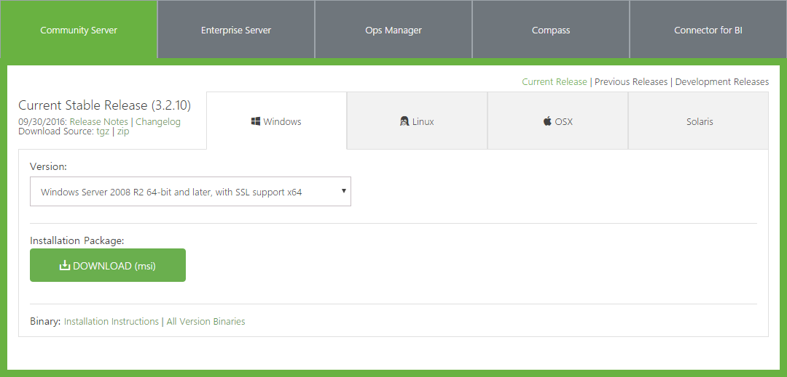
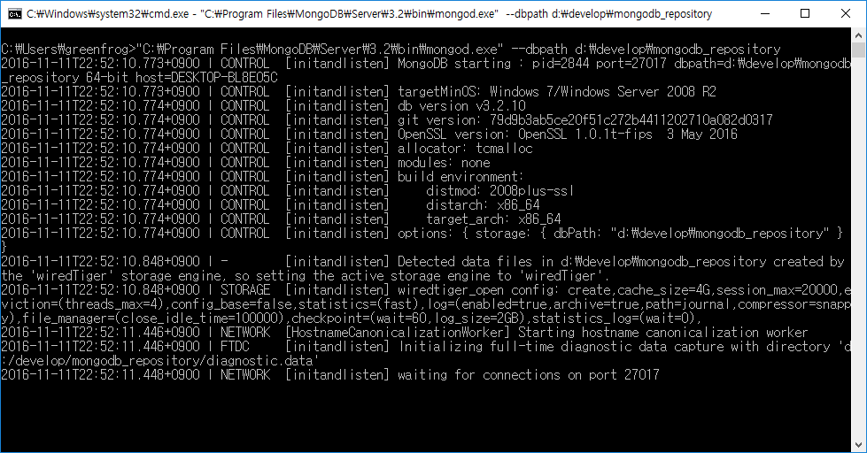
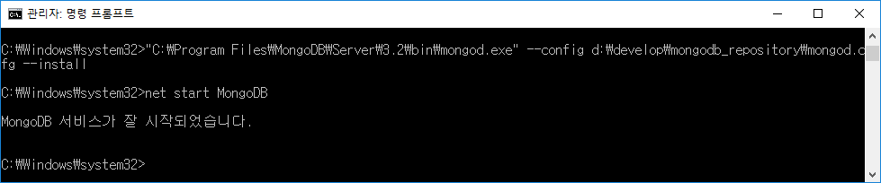
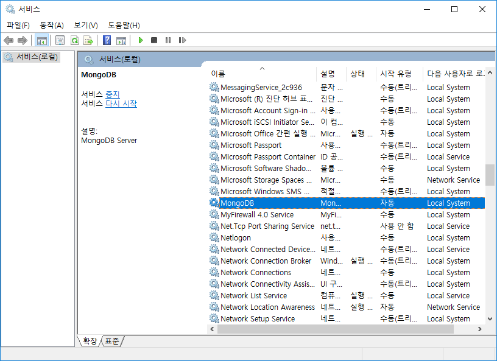
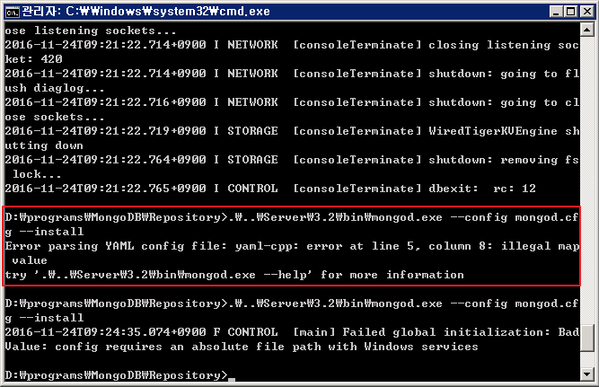
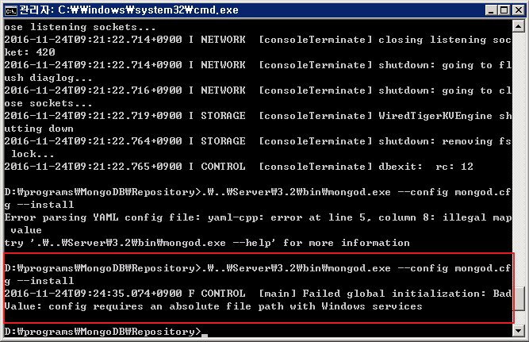

# MongoDB Community Edition, Windows 10에서 설치하기

## 개요
MongoDB(3.2.10 / Windows Server 2008 R2 64-bit and later, with SSl support x64)를 기준으로 Windows 10에서의 설치와 서비스 등록을 통한 자동 실행을 설명한다.

## 설치

1. [MongoDB 다운로드](https://www.mongodb.com/download-center#community)에서 Windows Server 2008 R2 64-bit and later, with SSl support x64를 다운로드 받는다.

  

2. 다운로드 받은 인스톨 파일을 실행해서 설치하도록한다.
3. 설치가 완료되면 실행에 앞서 MongoDB가 사용할 [data directory](https://docs.mongodb.com/manual/reference/glossary/#term-dbpath)를 설정해주어야한다. [data directory](https://docs.mongodb.com/manual/reference/glossary/#term-dbpath)란 간단히 말해서 MongDB가 데이터를 저장할 저장소 경로를 이야기한다. 다음 명령을 통해서 [data directory](https://docs.mongodb.com/manual/reference/glossary/#term-dbpath)를 먼저 생성한다.

  >c:\\> mkdir d:\\develop\\mongodb_repository

4. 이제 MongoDB를 실행시킬 차례다. MongoDB의 실행은 mongod.exe 파일을 통해서 한다. mongod.exe의 **--dbpath**를 통해서 [data directory](https://docs.mongodb.com/manual/reference/glossary/#term-dbpath)의 경로를 지정하여 MongoDB를 실행하도록 한다.

  >c:\\>C:\\Program Files\\MongoDB\\Server\\3.2\\bin\\mongod.exe" --dbpath "d:\\develop\\mongodb_repository

  

## 서비스 등록

위와 같은 방법으로 MongoDB를 실행하게 되면 필요시마다 MongoDB를 수동으로 실행시켜야해서 번거롭다. 따라서, MongoDB를 서비스로 등록해서 사용하는 방법을 사용하면 편하다.

앞선 과정을 마쳤다고 가정하고 윈도우 서비스로 MongoDB를 등록하는 방법을 설명한다.

1. 먼저, 설정파일을 만들어야하는데, systemLog.path 옵션은 반드시 해야한다. 필요하다면 [configuration options](https://docs.mongodb.com/manual/reference/configuration-options/)를 참고해서 적절한 옵션을 추가하면 된다.

  예를들어, d:\\develop\\mongodb_repository\\mongod.cfg을 생성하고, [systemLog.path](https://docs.mongodb.com/manual/reference/configuration-options/#systemLog.path)와 [storage.dbPath](https://docs.mongodb.com/manual/reference/configuration-options/#storage.dbPath)를 설정한다.

  [systemLog.path](https://docs.mongodb.com/manual/reference/configuration-options/#systemLog.path)를 설정할때는 반드시 파일명을 제외한 경로가 미리 생성되어 있어야한다.

    systemLog:
      destination: file
      path: d:\develop\mongodb_repository\log\mongod.log
    storage:
      dbPath: d:\develop\mongodb_repository


2. 여기서부터는 **관리자 권한**을 획득한 명령 프롬프트에서 작업을 해야한다. MongoDB를 윈도우 서비스에 등록하기 위해서는 mongod.exe의 **--install**옵션과 **--config**옵션에 앞서 생성한 설정파일(d:\\develop\\mongodb_repository\\mongod.cfg)을 전달한다.

  >c:\\>C:\\Program Files\\MongoDB\\Server\\3.2\\bin\\mongod.exe" --config d:\\develop\\mongodb_repository\\mongod.cfg --Install

3. 서비스 설치가 되면 자동으로 서비스를 실행시켜주지 않기 때문에 다음 명령을 통해 서비스를 실행시킨다.

 >net start MongoDB

 

 위 명령이 정상적으로 실행되면 MongoDB의 시작유형은 '자동'으로 설정되어 서비스가 실행되므로 다음부터는 MongoDB에 문제가 있지 않는 이상 컴퓨터가 부팅되면 MongoDB 서비스는 자동으로 실행된다.

 

## 트러블 슈팅

### Error parsing YAML config file: yaml-cpp: error at line 5, column 8: illegal map value

윈도우 서비스를 등록하기 위해 설정파일을 만든 후 서비스 등록 명령을 Command에서 실행시켰더니 다음 그림과 같은 오류가 발생하였다.



위 문제는 설정파일을 작성을 잘못했을 때 발생하는데, Yaml형식은 Key:Value 작성 시 space로만 분리를 해야한다고 한다. 하지만 설정 파일을 만들 때 tab을 사용한 것이 화근이 되었다.

아래는 tab을 사용해 문제가 되었던 설정파일 내용이다.

```
systemLog:
  destination: file
  path: D:\programs\MongoDB\Repository\log\mongod.log
storage:
  dbPath: D:\programs\MongoDB\Repository
```

이를 space로 변경해서 저장하고 실행하면 문제가 해결된다.

```
systemLog:
 destination: file
 path: D:\programs\MongoDB\Repository\log\mongod.log
storage:
 dbPath: D:\programs\MongoDB\Repository
```

### [main] Failed global initialization: Bad Value: config requires an absolute file path with Windows services

설정파일을 정의하고 윈도우 서비스 등록을 위해 명령을 날리면 다음과 같은 오류가 발생하였다.



위 문제는 설정파일의 경로가 상대경로여서 발생한 문제로 절대경로로 입력해주면 문제가 해결된다.

## 참조

* [Install MongoDB Community Edition on Windows](https://docs.mongodb.com/manual/tutorial/install-mongodb-on-windows/#configure-a-windows-service-for-mongodb-community-edition)
