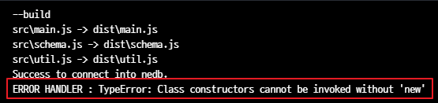

# [Camo](https://github.com/scottwrobinson/camo)를 이용한 CRUD 예제 (ver. ES6)

## 개요

앞서 작성했던 [Camo를 이용한 CRUD 예제](./../CRUD)는 ES5 기준으로 예제가 작성되었다. 이를 ES6 기준으로 수정한 예제.

## 이슈

코드를 ES6기준으로 수정 후 [babel](https://babeljs.io/)을 통해 컴파일 한 후 Movie 도큐먼트를 생성했을 때 다음과 같은 오류가 발생하였다.



원인은 [babel](https://babeljs.io/)을 통해 소스 코드를 컴파일하기 위한 [babel-preset-es2015](https://www.npmjs.com/package/babel-preset-es2015)모듈이 [Camo](https://github.com/scottwrobinson/camo)에 대해서는 정상적으로 컴파일을 지원하지 못하기 때문에 발생한 문제였다.

따라서, [Camo](https://github.com/scottwrobinson/camo)를 사용할 때는 이 모듈을 정확하게 지원하는 [babel-preset-camo](https://github.com/scottwrobinson/babel-preset-camo) 모듈을 사용해야한다.

우선, 다음 명령을 통해 [babel-preset-es2015](https://www.npmjs.com/package/babel-preset-es2015)모듈을 삭제하자.

```
npm uninstall --save-dev babel-preset-es2015
```

그리고 다음 명령을 통해 [babel-preset-camo](https://github.com/scottwrobinson/babel-preset-camo) 모듈을 설치한다.

```
npm install --save babel-preset-camo
```

설치가 다 됐으면, .babelrc 파일을 수정해야한다. 수정 전에는 다음과 같이 작성되어있다.

```json
{
  "presets": ["es2015"]
}
```

이를 다음과 같이 수정해준다.

```json
{
  "presets": ["camo"]
}
```

이제 빌드를 하면 정상적으로 동작하는것을 확인할 수 있다.


## 참조

* [babel-preset-camo](https://github.com/scottwrobinson/babel-preset-camo)
