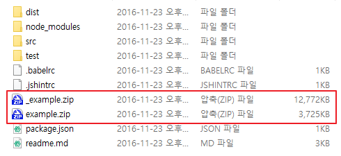
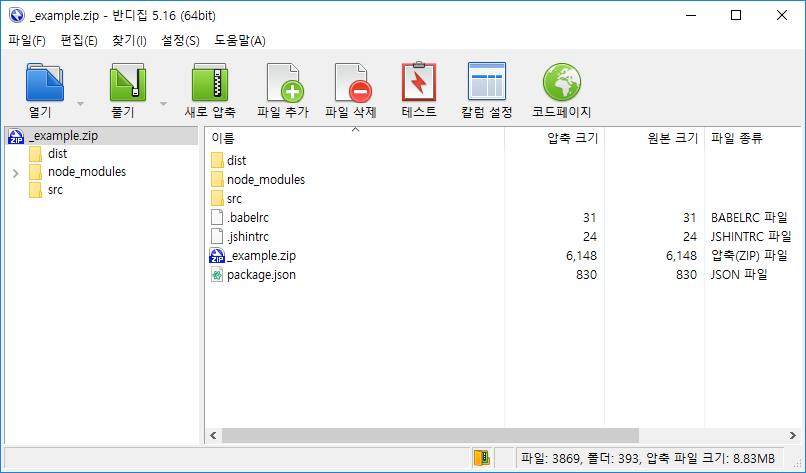
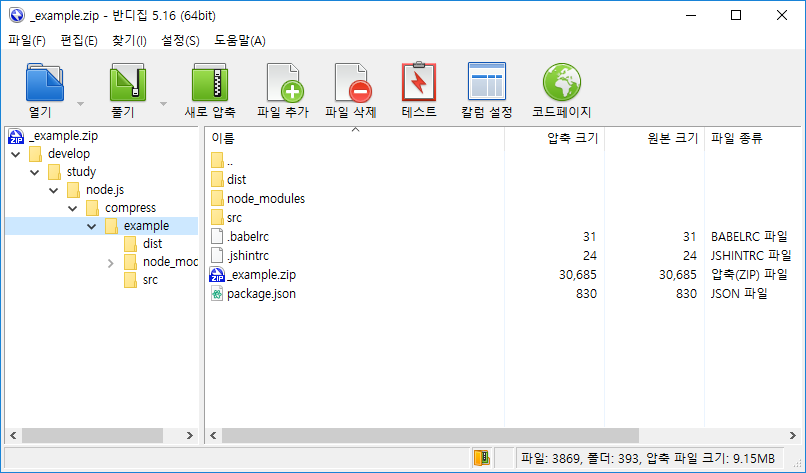

# 파일 압축하기

## 개요

프로젝트를 진행하면서 특정 경로를 압축해야하는 요구사항이 있어서 압축 라이브러리를 찾아보던 중 [node-archiver](https://github.com/archiverjs/node-archiver) 가장 널리 사용되는 것 같아서 적용해보았다.

## 사용법

```javascript
import fs from 'fs';
import path from 'path';
import archiver from 'archiver';

// 압축 파일을 생성하기 위하 스트림을 생성한다.
const output = fs.createWriteStream('./example.zip');

// zlib을 통해 압축을 수행하기 위한 아카이브를 생성한다.
const archive = archiver('zip', {
  // 예제에는 true로 설정되어 있지만, true로 설정하면
  // zip 파일로 파일 목록들을 묶을 뿐 압축은 수행하지 않는다.
  // 압축이 목적이라면, 이 옵션은 꺼두어야하며 이것이 default값이다.
  store: false
});

// 압축이 끝났을 때 호출되는 이벤트
output.on('close', function() {
  console.log(archive.pointer() + ' total bytes');
  console.log('압축이 끝나고, 파일 스트림이 닫힌다.');
});

// 압축 중 에러가 발생했을 때 호출되는 이벤트
archive.on('error', function(err) {
  console.error('---- ERROR HANDLER : ' + err.stack);
});

// 압축 된 데이터를 파일 스트림으로 연결한다.
archive.pipe(output);

// 압축을 하기 위한 경로 지정. 현재 프로젝트 경로 전달.
archive.directory('./');

// 압축을 하기 위한 파일 추가 또는 경로 전달을 종료한다. 이때, 압축은 비동기로 진행 중이다.
archive.finalize();

```

## 주의사항

#### 1. store 옵션
아카이브를 생성할 때, 공식 사이트의 예제에는 store옵션에 true를 설정해 놓았는데 이렇게 하면 압축을 수행하지 않고 파일 목록을 그저 zip파일로 묶기만한다.

```javascript
// zlib을 통해 압축을 수행하기 위한 아카이브를 생성한다.
const archive = archiver('zip', {
  // 예제에는 true로 설정되어 있지만, true로 설정하면
  // zip 파일로 파일 목록들을 묶을 뿐 압축은 수행하지 않는다.
  // 압축이 목적이라면, 이 옵션은 꺼두어야하며 이것이 default값이다.
    store: false
});
```
다음 그림에서 _example.zip은 store옵션을 true로 설정하여 압축을 하지 않은것이고, example.zip은 false로 설정하여 압축을 수행한 결과이다.



따라서, 압축을 할 목적이라면 store 옵션을 반드시 **false**로 설정해야하며 false가 default값이기도하다.

#### 2. archive.directory 메소드

archive.directory 메소드로 경로를 전달하는 방법에 따라 압축 결과가 달라진다. 일반적으로 현재 경로를 기준으로 압축을 하고자 한다면 반드시 './'와 같이 경로를 전달해주어야한다. 만약, path.join 또는 path.resolve를 사용하면 드라이브 명을 제외한 압축 대상 경로의 상위 경로들이 함께 압축된다.

```javascript
// 압축을 하기 위한 경로 지정. 현재 프로젝트 경로 전달.
archive.directory('./');
```

위와 같이 경로를 전달하면 다음 그림과 같이 압축이 된다.



```javascript
// 압축을 하기 위한 경로 지정. 현재 프로젝트 경로 전달.
archive.directory(path.join(__dirname + '/../'));
```


하지만 위와 같이 경로를 전달하면 다음 그림과 같이 압축이 된다.

## 참고

* [node-archiver](https://github.com/archiverjs/node-archiver)
* [archiverjs.com](https://archiverjs.com/docs/)
