# [i18n-node](https://github.com/mashpie/i18n-node)

[i18n-node](https://github.com/mashpie/i18n-node)는 Node.js에서 다국어를 처리하기 위한 라이브러리이다.

i18n이란?
라이브버리 이름의 일부로 사용 된 i18n이라는 단어는 지역화를 할 수 있는 소프트웨어를 설계하는 과정을 지칭하는 일반명사이다. 이를 wikipedia의 [Internationalization and localization](https://en.wikipedia.org/wiki/Internationalization_and_localization)에 있는 글을 참조하면 다음과 같다.

>In computing, internationalization and localization are means of adapting computer software to different languages, regional differences and technical requirements of a target market (locale).[1](https://en.wikipedia.org/wiki/Internationalization_and_localization#cite_note-SFW-1) Internationalization is the process of designing a software application so that it can potentially be adapted to various languages and regions without engineering changes. Localization is the process of adapting internationalized software for a specific region or language by adding locale-specific components and translating text. Localization (which is potentially performed multiple times, for different locales) uses the infrastructure or flexibility provided by internationalization (which is ideally performed only once, or as an integral part of ongoing development).[2](https://en.wikipedia.org/wiki/Internationalization_and_localization#cite_note-2)

또 다음 내용을 보면 Internationalization을 i18n이라고 하고, Localization을 L10n이라고 한다고 한다. 각 명칭의 유래가 재미있다.

>The terms are frequently abbreviated to the numeronyms i18n (where 18 stands for the number of letters between the first i and the last n in the word “internationalization,” a usage coined at DEC in the 1970s or 80s)[3](https://en.wikipedia.org/wiki/Internationalization_and_localization#cite_note-3)[4](https://en.wikipedia.org/wiki/Internationalization_and_localization#cite_note-4)and L10n for “localization,” due to the length of the words.[5](https://en.wikipedia.org/wiki/Internationalization_and_localization#cite_note-5)

i18n-node의 사용법은 간단한데 .. 만약, express를 사용하고 있다면, [express4-setLocale](https://github.com/mashpie/i18n-node/tree/master/examples/express4-setLocale)을 참고하면 된다.

그런데, 이 예제를 참고해서 코딩을 하다, 웹 브라우저를 통해 테스트를 할 때 지역화 처리가 정상적으로 되지 않는 문제가 발생하였다. 관련 내용은 다음과 같다.

이 예제를 보면 locales 경로에 각각 아랍, 독일, 영어 메시지를 처리할 수 있는 json 파일들이 다음과 같이 존재한다.

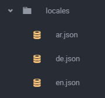

다음과 같이(노란색 밑줄) 'en', 'de', 'ar' 문자로 json 파일을 찾아 메시지를 출력할 수 있도록 되어있다.
i18n은 locales에 작성된 문자에 json확장자를 붙여서 directory 속성에 등록 된 경로에서 지역화 처리를 할 메시지 파일을 찾는다.

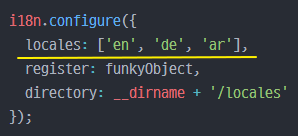

이때,  다음 코드에서 문제가 발생할 수도있다. 다음 예제코드의 주석을 보면 'uses locale as guessed by accept-headers'라고 되어있는데, request 헤더의 accept-headers로 실려오는 값을 통해서 위 환경 설정에서 사용한 locales의 지역화 파일을 사용한다는 이야기이다.

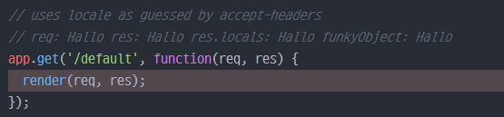

Postman과 같은 HTTP Client 테스팅 툴을 통해서 request header의 accept-header 속성을 주고 테스트 해보면 정상적으로 동작되는 것을 확인할 수 있다.

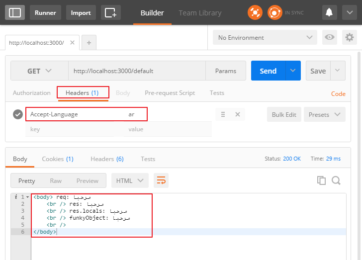

하지만, Chrome과 같은 웹 브라우저를 통해 같은 테스트를 진행하면, 다음과 같이 영어로 응답이 된다.

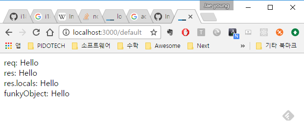

원인을 파악하기 위해서 앞선 예제에 다음과 같이 Request Header로 실려 온 accept-headers 속성의 데이터를 확인해보았다.

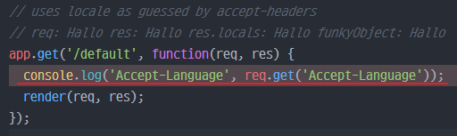

Postman과 Chrome 각각에서 테스트한 결과는 다음과 같다.

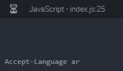
_[Postman]_

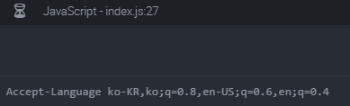
_[Chrome]_

Chrome에서의 테스트 결과를 보면 accept-language 속성 값이 i18n의 설정값 및 이에 대응하는 파일명과 다름을 알 수 있다. 따라서 i18n에서는 지역화를 위한 파일을 찾지 못하는 것이 원인이었다.

이를 정상적으로 처리하기 위해서 우선 locales 폴더에 한글 json파일(ko.json)을 추가하고, 테스트의 편의를 위해서 de.json과 ar.json을 삭제하였다.

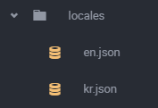

kr.json의 내용은 다음과 같다.

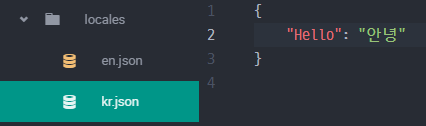

그리고 i18n.config 함수의 설정 내용을 다음과 같이 수정해야한다. 다음 빨간색 박스의 내용을 추가하자. 아래 내용은 Chrome의 테스트 결과와 같이 ko-KR, en-US와 같은 형식으로 Accept-Language 속성 값이 전달 되면 각각 'en', 'kr'로 값을 대체해서 처리하라는 내용을 설정하는 것이다.

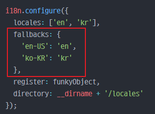

그리고 다시 Chrome에서 테스트를 진행해보면 다음과 같이 정상적으로 처리된다.

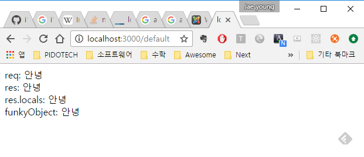
