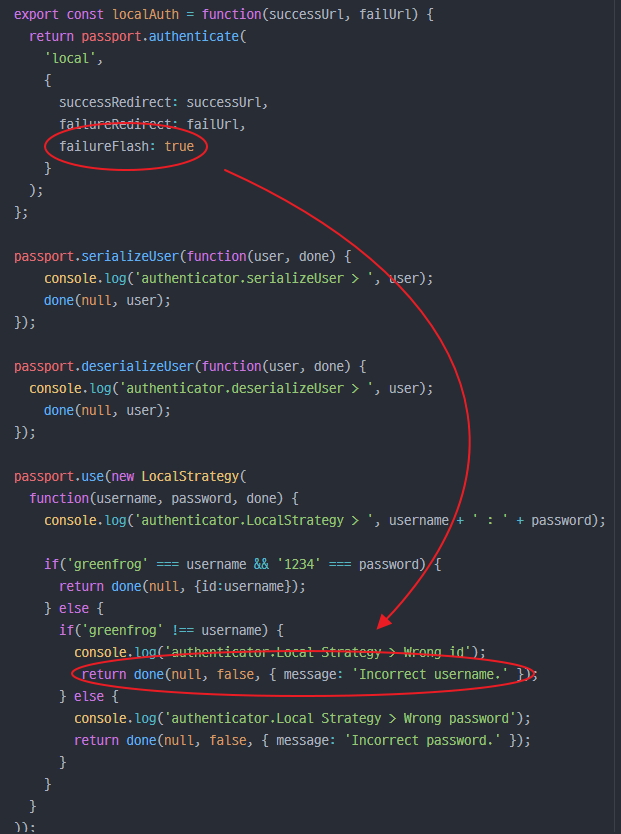
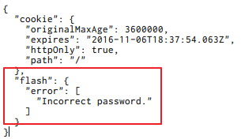

# req.flash is not a function

## 문제



Passport.js 라이브러리를 통해서 인증코드를 작성하던 중 failureFlash 속성을 true로 설정하고

```javascript
passport.authenticate(
  'local',
  {
    successRedirect: successUrl,
    failureRedirect: failUrl,
    failureFlash: true
  }
)
```

인증 도중 ID가 잘못되어 다음 코드가 동작되면,

```javascript
done(null, false, { message: 'Incorrect username.'});
```
예외가 발생하는데, 예외를 잡아서 출력해보면 다음과 같은 메시지가 출력된다.

```
TypeError : req.flash is not a function
```

## 원인

Passport.js의 [Docs](http://passportjs.org/docs)의 'Flash Messages' 항목에는 다음과 같은 내용이 있다.

```
Setting the failureFlash option to true instructs Passport to flash an error message
using the message given by the strategy's verify callback, if any.
```

failureFlash옵션을 true로 설정하면 Passport가 인증 콜백 함수로부터 전달받은 message를 'flash'에 error message로 전달한다는 내용이다.

그리고 다음과 같은 내용도 있다.

```
Note: Using flash messages requires a req.flash() function.
Express 2.x provided this functionality, however it was removed from Express 3.x.
Use of connect-flash middleware is recommended to provide this functionality when using Express 3.x.
```

flash messages를 사용하는 것은 req.flash() 함수를 요구하는데, Express 2.x는 이 기능을 제공했지만 Express 3.x에서는 삭제되었다고 한다. 따라서 Express 3.x을 사용할 때 이 기능을 사용하기 위해서는  [connect-flash](https://github.com/jaredhanson/connect-flash) 미들웨어를 사용할 것을 권장한다고 한다.

그런데 여기서 .. 도대체 flash messages라는 내용이 나오는데 이것이 도대체 뭐람 ...?? 이에 대한 내용은 [connect-flash](https://github.com/jaredhanson/connect-flash)의 Github 설명에 나와있다. 다음과 같다.

```
The flash is a special area of the session used for storing messages.
Messages are written to the flash and cleared after being displayed to the user.
The flash is typically used in combination with redirects,
ensuring that the message is available to the next page that is to be rendered.
```

'flash'라는 것이 메시지를 저장하기 위한 세션의 특별한 장소라고 한다. 메시지들은 flash에 저장되고 사용자에게 보여진 후 삭제된다고 한다. 'flash'는 일반적으로 '리다이렉트'와 결합되어 사용되고, 다음 페이지에서 메시지를 사용할 수 있도록 보장한다고 한다.

위 내용을 종합하여 간단히 정리하면, 'flash'라는 것은 특정 메시지를 세션에 저장하기 위한 장소이며, Passport는 여기에 error 메시지를 저장한다는 것이다.

방금 정리한 내용이 맞는지 확인해봤다. 이때 주의해야하는 것은 'flash' 메시지를 세션에서 꺼내면 안된다. 꺼내버리면 위에 설명한 것과 같이 'flash'에 저장된 메시지가 삭제되어 버린다. 일부러 로그인 에러를 내고 세션에 저장된 내용을 살펴보면 다음과 같다.



앞서 설명했던 내용들이 위 그림을 통해 모두 이해된다. 결국 'flash'는 세션의 'flash'라는 객체로 존재하고 Passport는 'flash'객체 내에 error라는 배열로 에러 메시지를 보관한다.

## 해결

위 문제를 해결하는 것은 아주 간단하다. [connect-flash](https://github.com/jaredhanson/connect-flash)를 설치하고 Express의 Middleware로 등록해주면 된다.

사용방법은 [connect-flash](https://github.com/jaredhanson/connect-flash)에 잘 설명되어 있으므로 생략!

## 참조

* [Passport - Flash Messages](http://passportjs.org/docs)
* [connect-flash](https://github.com/jaredhanson/connect-flash)
