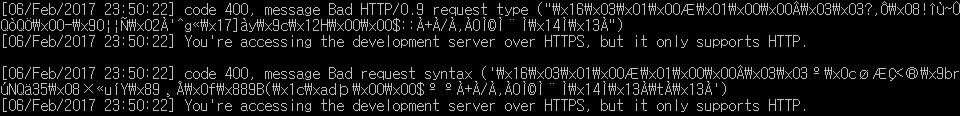

# 400 Bad Request Syntax 에러에 대해서

## 문제

클라이언트가 서버의 REST API를 호출하는데 서버측에서 다음과 같은 오류가 발생하였다. 

## 해결

해당 오류는 서버에 Https 프로토콜을 사용해서 접근했을 때 발생하는 문제로, Http 프로토콜을 통해 접근하면 해결된다.

## 참조

[Django: 400 bad request syntax - what does this message mean?](http://stackoverflow.com/questions/7929460/django-400-bad-request-syntax-what-does-this-message-mean)