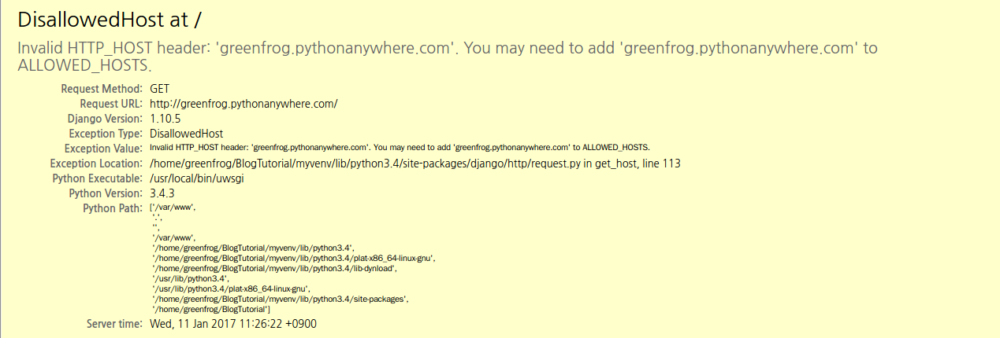

# DisallowedHost at /

## 개발 환경
Ubuntu 14.04
PyCharm 2016.3.2
Python 3.4
Django 1.10.5

## 문제

[pythonanywhere](https://www.pythonanywhere.com)에 스터디 중인 프로젝트를 퍼블리싱하였는데, 다음과 같은 에러가 발생하였다.



## 해결

위 문제는 settings.py파일의 다음 코드를 설정하지 않았기 때문에 발생한 문제이다.

```python
#ALLOWED_HOSTS =
```

장고로 개발한 프로젝트를 웹에 퍼블리싱하기 위해서는 위 설정에 퍼블리싱되는 서버의 주소르 작성해주어야한다.
다음과 같이 처리하여 해결하였으며, 포트는 별도로 추가해주지 않아도 된다.

```python
ALLOWED_HOSTS = ['greenfrog.pythonanywhere.com']
```
stackoverflow의 [“DisallowedHost at /” django error](http://stackoverflow.com/questions/40667519/disallowedhost-at-django-error) 글에 의하면, 장고는 요청을 받을 때 settings.py의 ALLOWED_HOSTS에 설정 된 호스트와 HTTP request의 Host header에 실려 온 URL 또는 IP 주소가 동일한지 확인한다고 한다.
이런 동작을 하는 이유는 겉으로는 안전해 보이는 대부분의 웹 서버 설정에서 조차 HTTP Host header 공격을 예방하기 위한 조치라고 한다.

## 참조

* [“DisallowedHost at /” django error](http://stackoverflow.com/questions/40667519/disallowedhost-at-django-error)
