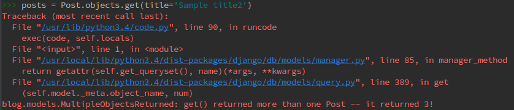
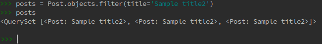

# get returned more than one

## 개발 환경

* Ubuntu 14.04
* PyCharm 2016.3.2
* Python 3.4
* Django 1.10.5

## 개요

장고 스터디를 하면서  Model.objects.get 메소드를 통해 쿼리를 수행하였는데 다음과 같은 오류 메시지를 받았다.

## 해결

해당 API를 확인해보았더니, Model.objects.get은 QuerySet을 반환하는 것이 아닌, Single Object만을 반환한다.

오류 메시지의 마지막을 자세히 보면 다음과 같이 힌트가 있다.
>blog.models.MultipleObjectsReturned: get() returned more than one Post -- it returned 3!

이를 QuerySet을 반환하는 Model.object.filter로 수정하면 잘 처리된다.

## 참조

* [Retrieving a single object with get()](https://docs.djangoproject.com/en/1.10/topics/db/queries/#retrieving-a-single-object-with-get)
