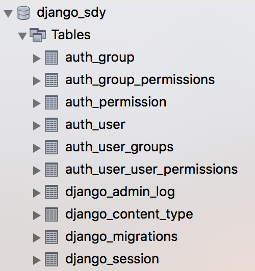
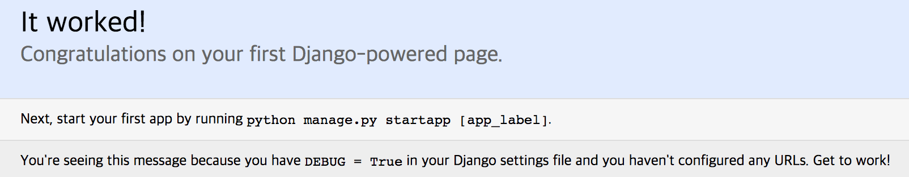

# How to start Django project

Django의 프로젝트를 시작하는 방법에 대해서 알아보자.
대부분의 Django Tutorial의 Python의 [virtualenv](https://virtualenv.pypa.io/en/stable/)환경을 통해 Django 환경을 구축하는 것을 권장하지만, 본 문서의 경우 Docker를 사용하므로 이 부분은 설명하지 않는다. 

#### Requirement

* Ubuntu Linux version 17.10
* Mac macOS High Sierra 10.13.1 (17B1003)
    * Docker for mac 
    * Docker CE 17.09.1-ce-mac42 (21090)
    * MySQL ver 14.14 Distrib 5.7.20, for Linux (x86_64) using  EditLine wrapper
* Python 2.7
* Django 1.11.5

## Creating Django Project

**django-admin**은 Django의 Project를 생성하고 관리하기 위한 Command-Line 툴이다.
Django는 프로젝트를 생성할 때 **django-admin**을 사용한다. 

>$ django-admin startproject <project name> .

예를들어, study_django라는 이름으로 Django Project를 생성해보자. 

```bash
$ django-admin startproject study_django .
```

다음은 위 명령을 통해 생성한 study_django 프로젝트이다. 

```sh
|-- manage.py
`-- study_django
    |-- __init__.py
    |-- settings.py
    |-- urls.py
    `-- wsgi.py
```

django-admin command line tool(이하 django-admin)을 통해 생성 된 파일들에 대한 설명이다. 

#### manage.py

manage.py 파일은 django-admin의 명령을 위임한다. 하지만 다음 두 가지 설정을 내부적으로 처리해준다. 

1. 해당 프로젝트의 패키지들을 sys.path에 등록해준다. 
2. DJANGO_SETTINGS_MODULE environment에 해당 프로젝트의 settings.py 파일을 등록해준다. 

Django 프로젝트를 통해 서버를 실행시키거나 테스트 코드를 동작시키거나 또는 DB Sync를 하는 등의 작업을 하기 위해서는 위 작업이 선행되어야하는데 manage.py 파일은 이러한 설정을 내부적으로 처리해준다. 

따라서, django-admin의 경우 Django 프로젝트를 생성하는 단계에서 주로 사용되고, 프로젝트가 생성 된 후 django-admin의 명령을 수행할 때는 주로 manage.py를 사용하게 된다. 

예를들어, 다음과 같이 개발한 웹 서비스를 테스트하기 위해 development web server를 띄워야할 경우 django-admin을 사용하면 다음과 같이 해야한다.

```sh
$ django-admin runserver 0:<PORT> --settings=study_django.settings
```

하지만, manage.py를 사용하면 앞서와 같이 setting.py를 설정해주지 않아도 된다. 

```sh
$ django-admin runserver 0:<PORT>
```

단, manage.py의 경우 기본적으로 프로젝트의 settings.py를 DJANGO_SETTINGS_MODULE 환경변수에 설정해서 사용하기 때문에, 다중 설정파일을 관리하는 경우는 django-admin 명령과 --settings 옵션을 사용해야한다. 

#### settings.py

해당 Django 프로젝트를 통해 생성되는 웹 서비스의 설정을 담고 있다. 

다양한 환경을 위한 설정 파일 관리방법에 대해서는 다음 링크를 참조하자.

[How to manage settings.py for multiple environment](https://github.com/greenfrog82/study/tree/master/python/Django/manage_settings_multiple_env#how-to-manage-settingspy-for-multiple-environment)

#### urls.py

해당 Django 프로젝트를 통해 생성된 웹 서비스가 제공하는 서비스와 이를 호출하기 위한 URL의 맵핑정보가 담겨있다. 

#### wsgi.py

Apache 또는 nginx와 같이 WSGI를 지원하는 웹서버와 Django web applicaiton을 연동하기 위한 정보가 담겨있다. 

## Setting Database

django-admin을 통해 프로젝트를 생성하면 SQLite를 통해 기본 DB 설정을 만들어 놓는다. 
이 설정은 settings.py에서 찾을 수 있으며, 다음과 같다. 

```python
DATABASES = {
    'default': {
        'ENGINE': 'django.db.backends.sqlite3',
        'NAME': os.path.join(BASE_DIR, 'db.sqlite3'),
    }
}
```

일반적으로 공부목적이나 간단한 Web Application을 개발할 때 사용하면 좋을 것 같지만, 대부분은 공부목적으로라도 MySQL과 같은 데이터베이스를 설치해두고 이와 관련된 클라이언트 툴들도 자신의 Local PC에 설정해둘것이기 것이다. 
나의 경우 MySQL을 사용하고 있으므로 다음 링크에 MySQL 서버를 설정하는 내용을 정리해두었다. 

[How to access mysql on host from Django application on docker container](https://github.com/greenfrog82/study/tree/master/python/Django/connect_mysql)

데이터베이스 설정을 맞추었으면 다음 명령을 통해 Django Applicaiton을 실행시키기 위한 Django의 기본 ORM과 데이터베이스를 동기화하도록 한다.
여기서 Django ORM, 데이터베이스 동기화 등이 생소할 수 있다. 이에 대해서 나중에 자세히 알아보도록 하고 여기까지가 데이터베이스에 대한 기본 설정이므로 따라해보자.

```sh
$ ./manage.py migrate
```

위 명령을 수행하면 다음과 같은 내용들이 출력되는데 Django가 제공하는 기능을 위한 ORM과 DB의 스키마가 sync된다. 

```sh
./manage.py migrate
Operations to perform:
  Apply all migrations: admin, auth, contenttypes, sessions
Running migrations:
  Applying contenttypes.0001_initial... OK
  Applying auth.0001_initial... OK
  Applying admin.0001_initial... OK
  Applying admin.0002_logentry_remove_auto_add... OK
  Applying contenttypes.0002_remove_content_type_name... OK
  Applying auth.0002_alter_permission_name_max_length... OK
  Applying auth.0003_alter_user_email_max_length... OK
  Applying auth.0004_alter_user_username_opts... OK
  Applying auth.0005_alter_user_last_login_null... OK
  Applying auth.0006_require_contenttypes_0002... OK
  Applying auth.0007_alter_validators_add_error_messages... OK
  Applying auth.0008_alter_user_username_max_length... OK
  Applying sessions.0001_initial... OK
```

다음은 위 명령을 수행한 후 MySQL에서 djang_sdy 데이터베이스에 생성된 테이블들이다. 


 
## Run server with the django development server

Django development server는 Django를 통해 개발된 Web Applicaiton을 테스트하기 위한 경량화된 Web Server이다. 이를 통해 지금까지 셋팅한 Django Web Applicaion을 기동해보자. 

다음 명령을 실행한다. 

```sh
$ ./manage.py runserver 0:8080
```

다음은 위 명령을 실행한 결과이다. 
서버가 정상적으로 기동되어 8080 포트를 Listen하고 있는것을 알 수 있다. 

```sh
Performing system checks...

System check identified no issues (0 silenced).
January 13, 2018 - 05:08:56
Django version 1.11.5, using settings 'study_django.settings'
Starting development server at http://0:8080/
Quit the server with CONTROL-C.
```

웹브라우저를 통해 접속했을 때 다음 화면이 나오면 성공!



## Reference

* [Your first Django project!
](https://tutorial.djangogirls.org/en/django_start_project/)
* [django-admin and manage.py](django-admin and manage.py)