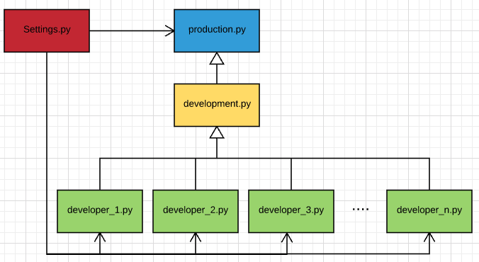

# How to manage settings.py for multiple environment

Django를 통해 웹 서비스를 개발하고 운영하다보면 settings.py 파일의 설정을 다양하게 관리해야하는 경우가 발생한다. 가장 일반적인 예로 개발환경과 운영환경의 설정이 다를 수 있고, 개발환경의 설정 역시 각 개발자마다 다를 수 있다. 

앞서의 내용을 좀 더 구체적으로 이야기해보면 운영환경에서는 DEBUG 설정이 False로 꺼져있어야 할 것이고 DB는 운영환경의 DB 설정을 가지고 있어야 할 것이다. 개발환경의 경우 어떤 개발자는 'debug_toolbar'와 같은 APP을 추가하여 사용할 수도 있지만 그렇지 않은 개발자가 있을수도 있다. 
만약, 이렇게 다양한 설정들을 분리하여 관리하고 있지 않다면, 개발환경에서의 설정은 Version Control System(이하 VCS)을 통해 관리되지 못할 것이다.

설정파일에는 비밀번호 등과 같은 VCS를 통해 관리되지 않아야하는 정보들도 존재한다. 이러한 정보들을 관리할 수 있는 방법에 대해서도 고민해볼 필요가 있다.

따라서, 다양한 환경에서 설정파일을 관리하기 위해 고려해야하는 항목들은 다음과 같다. 

* 개발 환경과 운영 환경의 설정 파일을 따로 관리할 수 있어야한다. 
* 개발 환경의 설정 역시 각각 개발자가 따로 관리할 수 있어야한다. 
* 중복 된 설정이 발생하지 않도록 해야한다. (설정의 변경 발생 시 수정작업은 한군데에서만 이루어져야한다.)
* 비밀번호 등과 같이 VCS를 통해 관리되지 않아야하는 정보들에 대한 관리가 가능해야한다.   

위 조건들 중 '중복 된 설정이 발생하지 않도록 해야한다.'가 아주 중요하다. 
개발 환경과 운영 환경의 설정파일이 나뉘고 개발 환경에서는 각각 개발자 별로 설정이 나뉘게 되면, 설정에 변경이 있는 경우 운영 환경과 개발 환경 그리고 각각 개발자 별로 관리되는 설정들을 모두 수정해주어야 하기 때문이다. 
이 문제를 해결하지 못하면 효과적으로 다양한 설정을 관리하고 있다고 할 수 없을 것이다. 

## Separating settings.py through import module

앞서 언급되었던 고려사항들 중 다음 3가지는 다양한 설정을 모듈로 나누고 이를 Import하는 방식으로 해결 할 수 있다. 

* 개발 환경과 운영 환경의 설정 파일을 따로 관리할 수 있어야한다. 
* 개발 환경의 설정 역시 각각 개발자가 따로 관리할 수 있어야한다. 
* 중복 된 설정이 발생하지 않도록 해야한다. (설정의 변경 발생 시 수정작업은 한군데에서만 이루어져야한다.)

예를들어, 모든 설정의 근간은 운영환경으로 할 것이다. Django에서 기본으로 제공되는 settings.py의 설정을 production.py 파일로 옮긴다. 
개발환경에서 사용 될 설정(development.py)은 production.py에 정의 된 모든 속성을 import한 후 필요에 따라 override 하거나 추가한다. 예를들어, DEBUG 옵션을 True로 설정하거나 DB정보를 운영환경에서 개발환경으로 변경해주는 등의 작업을 될 것이다. 
마지막으로 개발자별로 development.py에 정의 된 모든 속성을 import한 후 필요에 따라 override하거나 추가하면 된다. 

이렇게 분리 된 설정들을 Django에서 기본으로 제공되는 settings.py에서 import하여 사용하면 된다.
이때, development.py의 경우 개발자 별로 관리되는 설정 파일의 모체이고 설정이 사용되는 기준은 운영환경인지 아니면 특정 개발자의 개발 환경인지에 따라 달라지므로 settings.py에서 import할 필요가 없을 것이다. 

이 아이디어를 그림으로 나타내면 다음과 같다.



## How to select setting among imported setting modules at specific environment

[Django Best Practice: Settings file for multiple environments](https://medium.com/@ayarshabeer/django-best-practice-settings-file-for-multiple-environments-6d71c6966ee2)에서는 다음과 같이 각각의 설정 파일을 Django 서버를 실행시키는 단계에서 전달하도록 가이드하고 있다. 

```sh
$ python manage.py runserver --settings=mysite.settings.local
```

하지만, 이런 경우 개발자들이 Django server를 기동할 때나 settings.py를 import해서 사용하는 다른 코드들이 있는 경우 관련 코드들을 모두 자신이 사용하는 설정파일로 변경해줘야하는 번거로움이 발생할 것이다. 
따라서, 앞서 'Separating settings.py through import module'에서와 언급한 바와 같이 Django가 기본으로 제공하는 settings.py 파일에서 각 환경별로 분리했던 설정 모듈들을 import하는 방식을 사용한 것이다. 

하지만, 이 경우 settings.py파일에서 각 사용자 환경마다 import 해야하는 설정파일을 선택적으로 import 할 수 있어야한다.
이를 처리할 수 있는 다양한 방법을 생각해볼 수 있지만, Mac Address를 통해 통해 구분하는 방법이 유일성을 보장하는 좋은 방법이 될 것이다.

다음은 Mac Address를 통해 설정파일을 구분해서 import하는 settings.py 파일의 코드이다. 
각 환경별로 관리되어야하는 설정파일을 각 환경의 Mac Address를 통해 선택적으로 import하고 있으며, 환경별로 구분이 안되는 경우(else)는 운영환경을 위한 설정파일을 import하도록 코드가 작성되어 있다.

```python
# These codes are in settings.py
from uuid import getnode

mac_addr = getnode()

if 2485378154498 == mac_addr:
    from manage_settings.config.developer_1 import *
elif 3485378154498 == mac_addr:
    from manage_settings.config.developer_2 import *
else:
    from manage_settings.config.production import *
```

# How to manage security settings

보안과 관련 된 설정들의 경우 VCS에서 관리하지 않는것이 안전하다. 따라서 이러한 설정은 settings.py에서 따로 분리되어 VCS에서는 추적하지 않도록해야한다. 
결국 분리 된 보안관련 설정파일은 팀원들이 분산해서 파일을 가기있기 때문에 팀내 개발자들의 PC에서 관리되게 될 것이다. 

보안관련 설정파일을 Import하는 방식은 앞서 settings.py 
## Reference

* [Django Best Practice: Settings file for multiple environments](https://medium.com/@ayarshabeer/django-best-practice-settings-file-for-multiple-environments-6d71c6966ee2)