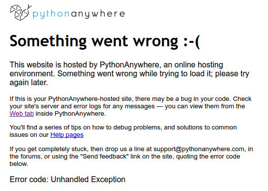
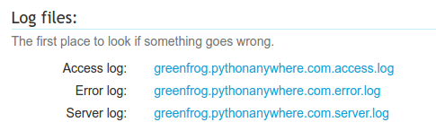
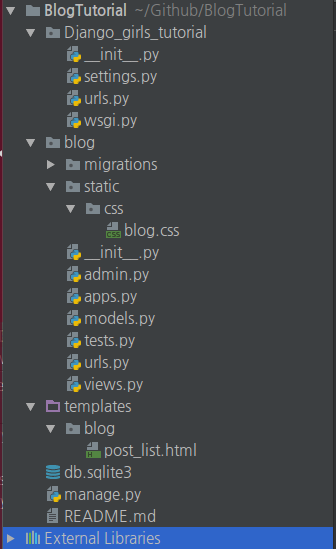

# XXX_pythonanywhere_com_wsgi.py 파일의 os.environ['DJANGO_SETTINGS_MODULE']에 옳바른 값 셋팅하기

## 문제

[pythonanywhere.com](https://www.pythonanywhere.com)에 연습 중이 장고걸스 블로그 튜토리얼 코드를 퍼블리싱하기 위해 코드를 옮기고 셋팅을 마친 후 퍼블리싱 된 웹 사이트에 접근해 보았더니 다음과 같은 오류가 발생하였다.



문제를 파악하기 위해서 'Web'탭에서 Log files: 문단의 Error log를 확인해 보았다.



로그 내용은 다음과 같다.

```
2017-01-11 10:21:56,482 :Error running WSGI application
2017-01-11 10:21:56,485 :ImportError: No module named 'mysite'
2017-01-11 10:21:56,485 :  File "/var/www/greenfrog_pythonanywhere_com_wsgi.py", line 13, in <module>
2017-01-11 10:21:56,485 :    application = DjangoWhiteNoise(get_wsgi_application())
2017-01-11 10:21:56,485 :
2017-01-11 10:21:56,485 :  File "/home/greenfrog/BlogTutorial/myvenv/lib/python3.4/site-packages/django/core/wsgi.py", line 13, in get_wsgi_application
2017-01-11 10:21:56,485 :    django.setup(set_prefix=False)
2017-01-11 10:21:56,485 :
2017-01-11 10:21:56,485 :  File "/home/greenfrog/BlogTutorial/myvenv/lib/python3.4/site-packages/django/__init__.py", line 22, in setup
2017-01-11 10:21:56,485 :    configure_logging(settings.LOGGING_CONFIG, settings.LOGGING)
2017-01-11 10:21:56,485 :
2017-01-11 10:21:56,485 :  File "/home/greenfrog/BlogTutorial/myvenv/lib/python3.4/site-packages/django/conf/__init__.py", line 53, in __getattr__
2017-01-11 10:21:56,485 :    self._setup(name)
2017-01-11 10:21:56,485 :
2017-01-11 10:21:56,486 :  File "/home/greenfrog/BlogTutorial/myvenv/lib/python3.4/site-packages/django/conf/__init__.py", line 41, in _setup
2017-01-11 10:21:56,486 :    self._wrapped = Settings(settings_module)
2017-01-11 10:21:56,486 :
2017-01-11 10:21:56,486 :  File "/home/greenfrog/BlogTutorial/myvenv/lib/python3.4/site-packages/django/conf/__init__.py", line 97, in __init__
2017-01-11 10:21:56,486 :    mod = importlib.import_module(self.SETTINGS_MODULE)
2017-01-11 10:21:56,486 :***************************************************
2017-01-11 10:21:56,486 :If you're seeing an import error and don't know why,
2017-01-11 10:21:56,486 :we have a dedicated help page to help you debug:
2017-01-11 10:21:56,486 :https://help.pythonanywhere.com/pages/DebuggingImportError/
2017-01-11 10:21:56,486 :***************************************************
```

여기서 주목할 내용은 다음인데 /var/www/greenfrog_pythonanywhere_com_wsgi.py의 설정이 잘못된 것이다.

```
2017-01-11 10:21:56,482 :Error running WSGI application
2017-01-11 10:21:56,485 :ImportError: No module named 'mysite'
2017-01-11 10:21:56,485 :  File "/var/www/greenfrog_pythonanywhere_com_wsgi.py", line 13, in <module>
```

문제가 되는 소스코드를 보면 다음과 같은데 장고걸스 튜토리얼의 내용을 그대로 작성한 것이다.

```python
import os
import sys

path = '/home/greenfrog/BlogTutorial'
if path not in sys.path:
    sys.path.append(path)

os.environ['DJANGO_SETTINGS_MODULE'] = 'mysite.settings'

from django.core.wsgi import get_wsgi_application
from whitenoise.django import DjangoWhiteNoise
application = DjangoWhiteNoise(get_wsgi_application())
```

문제가 된 코드는 다음으로 'mysite.settings'의 설정이 잘못된 것이다.

```python
os.environ['DJANGO_SETTINGS_MODULE'] = 'mysite.settings'
```

## 해결

PyCharm의 프로젝트 뷰어를 보면 작성 중인 프로젝트 구성은 다음과 같다. 이때, os.environ['DJANGO_SETTINGS_MODULE']에 설정해줘야하는 .settings의 앞 이름은 Django의 설정 코드들이 있는 경로 이름이다. 내 경우는 'Django_girls_tutorial'이 되겠다.



따라서 '/var/www/greenfrog_pythonanywhere_com_wsgi.py'에서 os.environ['DJANGO_SETTINGS_MODULE']의 설정부분은 다음과 같이 수정하니 정상적으로 프로젝트가 퍼블리싱 되었다.

```python
os.environ['DJANGO_SETTINGS_MODULE'] = 'Django_girls_tutorial.settings'
```

## 참조

* [Django girls tutorial - Distribution!](https://tutorial.djangogirls.org/ko/deploy/)
