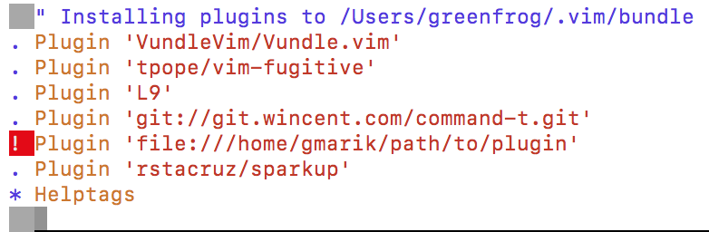
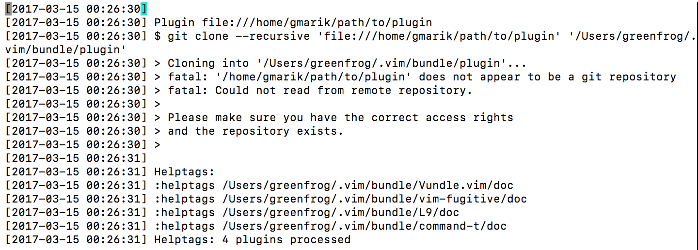

# [Vundle](https://github.com/VundleVim/Vundle.vim) 설치하기

## 개요

[Vundle](https://github.com/VundleVim/Vundle.vim)은 vim의 Plug-in Manager이다.  
[Vundle](https://github.com/VundleVim/Vundle.vim)을 설치하는 방법에 대해서 알아보자. 

## 설치하기

다음 명령을 통해 GitHub의[Vundle](https://github.com/VundleVim/Vundle.vim) Repository를 클론한다.
 
```
$ git clone https://github.com/VundleVim/Vundle.vim.git ~/.vim/bundle/Vundle.vim
```

그리고 다음 설정 코드를 .vimrc의 맨 상단에 복사한 후 :PlugInInstall 명령을 통해 플러그인을 설치한다. 

```bash
set nocompatible              " be iMproved, required
filetype off                  " required

" set the runtime path to include Vundle and initialize
set rtp+=~/.vim/bundle/Vundle.vim
call vundle#begin()
" alternatively, pass a path where Vundle should install plugins
"call vundle#begin('~/some/path/here')

" let Vundle manage Vundle, required
Plugin 'VundleVim/Vundle.vim'

" The following are examples of different formats supported.
" Keep Plugin commands between vundle#begin/end.
" plugin on GitHub repo
Plugin 'tpope/vim-fugitive'
" plugin from http://vim-scripts.org/vim/scripts.html
Plugin 'L9'
" Git plugin not hosted on GitHub
Plugin 'git://git.wincent.com/command-t.git'
" git repos on your local machine (i.e. when working on your own plugin)
Plugin 'file:///home/gmarik/path/to/plugin'
" The sparkup vim script is in a subdirectory of this repo called vim.
" Pass the path to set the runtimepath properly.
Plugin 'rstacruz/sparkup', {'rtp': 'vim/'}
" Install L9 and avoid a Naming conflict if you've already installed a
" different version somewhere else.
Plugin 'ascenator/L9', {'name': 'newL9'}

" All of your Plugins must be added before the following line
call vundle#end()            " required
filetype plugin indent on    " required
" To ignore plugin indent changes, instead use:
"filetype plugin on
"
" Brief help
" :PluginList       - lists configured plugins
" :PluginInstall    - installs plugins; append `!` to update or just :PluginUpdate
" :PluginSearch foo - searches for foo; append `!` to refresh local cache
" :PluginClean      - confirms removal of unused plugins; append `!` to auto-approve removal
"
" see :h vundle for more details or wiki for FAQ
" Put your non-Plugin stuff after this line
```

:PluginInstall 대신 command line에서 다음 명령을 통해서도 플러그인을 설치할 수 있다.

```
$ vim +PluginInstall +qall
```

위 내용은[Vundle](https://github.com/VundleVim/Vundle.vim)의 [Quick](https://github.com/VundleVim/Vundle.vim#quick-start)에 나오는 내용을 따라한것은데, 그래도 따라했더니 두 가지 문제가 발생하였다. 각각의 문제를 해결하는 방법을 알아보자. 

## 트러블슈팅


### .vimrc에[Vundle](https://github.com/VundleVim/Vundle.vim) configuration 설정 후PlugIn 설치 시 

아래 내용을 보면, 플러그인 설치 중 'file:///home/gmarik/path/to/plugin'에 대한 내용이 실패했음을 알 수 있다. 





분명[Vundle](https://github.com/VundleVim/Vundle.vim)의 [Quick](https://github.com/VundleVim/Vundle.vim#quick-start)에 나오있는데로 했는데 이상한 일이다. 

[Vundle](https://github.com/VundleVim/Vundle.vim)의 [Quick](https://github.com/VundleVim/Vundle.vim#quick-start)에 가서 다시 천천히 설명 글을 읽다보니 다음과 같은 글이있다. 

```
Put this at the top of your .vimrc to use Vundle. Remove plugins you don't need, they are for illustration purposes.
```

따라서, 설정 중 'file:///home/gmarik/path/to/plugin' 관련 내용을 삭제하고 다시 플러그인 설치를 진행헀더니 정상적으로 설치를 완료하였다. 

### vi 실행 시'Command already exists: add ! to replace it' 에러 메시지 출력 됨

```
greenfrogui-MacBook-Pro:bundle greenfrog$ vi
Error detected while processing /Users/greenfrog/.vim/bundle/newL9/plugin/l9.vim:
line   40:
E174: Command already exists: add ! to replace it
line   89:
E174: Command already exists: add ! to replace it
line  100:
E174: Command already exists: add ! to replace it
line  104:
E174: Command already exists: add ! to replace it
```

[Vundle](https://github.com/VundleVim/Vundle.vim)의 [Quick](https://github.com/VundleVim/Vundle.vim#quick-start)에서 안내하는 설정에 보면 L9 관련 플러그인이 두 개 존재하는 것을 알 수 있다. 
이들이 충돌하는 것인데, 나의 경우 "Plugin 'ascenator/L9', {'name': 'newL9'}" 설정을 지우고 이미 설치 된 플러그인을 다음 절차에 따라서 삭제하였다. 

1. 삭제하고자 했던 "Plugin 'ascenator/L9', {'name': 'newL9'}"을 .vimrc 설정에서 삭제한다.
2. :PluginUpdate 명령을 실행한다.
3. :PluginClean 명령을 실행한다.

## 참조

* [Vundle](https://github.com/VundleVim/Vundle.vim)
* [Error in installing Bundle for Vim](http://stackoverflow.com/questions/20394142/error-in-installing-bundle-for-vim)
* [How to unInstall plugin?](https://github.com/VundleVim/Vundle.vim/issues/733)


