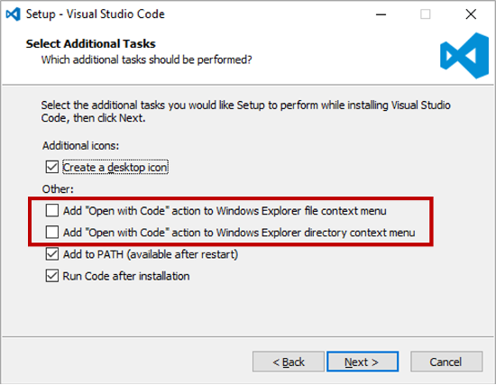

# 파일 탐색기에서 Context Menu를 통해 파일 또는 폴더를 VSCode에서 열기

VSCode를 설치하였는데, ATOM과 달리 파일 탐색기의 Context Menu에 VSCode가 보이지 않는다. 따라서, 파일 탐색기에서 Context Menu를 통해 파일이나 폴더를 VSCode에서 열지 못해 불편했는데 이를 해결할 수 있는 방법을 찾아보았다. 

다음 그림을 보면 VSCode를 설치할 때, 파일 탐색기의 Context Menu에 VSCode를 등록하는 메뉴가 있었던 모양인데 나는 이를 스킵했던 것 같다. 



하지만, 나와 같이 이미 설치를 해버린 경우는 다음과 같이 registry 등록 코드를 하나 만들어서 실행하는 방법도 있다. 

```bash
Windows Registry Editor Version 5.00
; Open files
[HKEY_CLASSES_ROOT\*\shell\Open with VS Code]
@="Edit with VS Code"
"Icon"="C:\\Program Files (x86)\\Microsoft VS Code\\Code.exe,0"
[HKEY_CLASSES_ROOT\*\shell\Open with VS Code\command]
@="\"C:\\Program Files (x86)\\Microsoft VS Code\\Code.exe\" \"%1\""
; This will make it appear when you right click ON a folder
; The "Icon" line can be removed if you don't want the icon to appear
[HKEY_CLASSES_ROOT\Directory\shell\vscode]
@="Open Folder as VS Code Project"
"Icon"="\"C:\\Program Files (x86)\\Microsoft VS Code\\Code.exe\",0"
[HKEY_CLASSES_ROOT\Directory\shell\vscode\command]
@="\"C:\\Program Files (x86)\\Microsoft VS Code\\Code.exe\" \"%1\""
; This will make it appear when you right click INSIDE a folder
; The "Icon" line can be removed if you don't want the icon to appear
[HKEY_CLASSES_ROOT\Directory\Background\shell\vscode]
@="Open Folder as VS Code Project"
"Icon"="\"C:\\Program Files (x86)\\Microsoft VS Code\\Code.exe\",0"
[HKEY_CLASSES_ROOT\Directory\Background\shell\vscode\command]
@="\"C:\\Program Files (x86)\\Microsoft VS Code\\Code.exe\" \"%V\""
```

위 코드를 vsCodeOpenFolder.reg와 같은 파일명으로 저장한 후 이 파일을 실행시키면 된다.


## 참고

* [Right click on Windows folder and open with Visual Studio Code](http://thisdavej.com/right-click-on-windows-folder-and-open-with-visual-studio-code/)